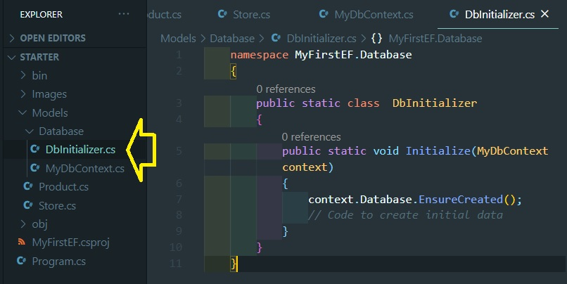
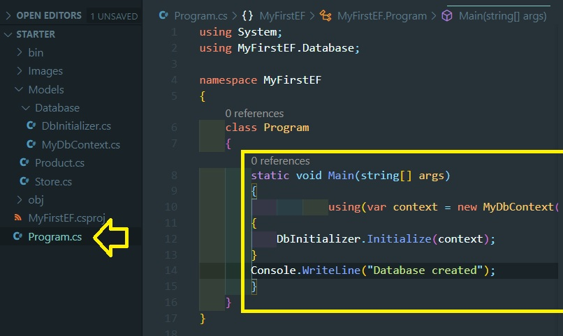
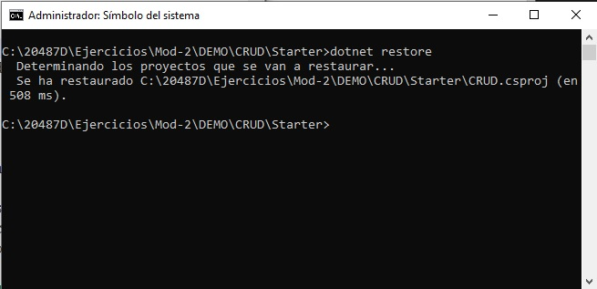

# Módulo 2: Consulta y manipulación de datos utilizando Entity Framework


Siempre cuando un camino comienza con  *[Repository Root]*, reemplacelo con el camino absoluto en el que el repositorio 20487 reside. Por ejemplo, si tu has cloneado o extraido el repositorio 20487 en la carpeta **C:\Users\John Doe\Downloads\20487**, cambiar la ruta de: **[Repository Root]\AllFiles\20487D\Mod01** a **C:\Users\John Doe\Downloads\20487\AllFiles\20487D\Mod01**.


Fichero de Instrucciones: Instructions\20487D_MOD02_DEMO.md

**Información:**

La entrega de la tarea realizada se guarda en una URL de GitHub con la solución y un readme con las siguiente información:

1. **Nombres y apellidos:** José René Fuentes Cortez
2. **Fecha:** 21 de Enero 2021.
3. **Resumen del Modulo 2:** Los ejercicios se dividen entre Laboratorios y MOC Demo que contienen ejercicios propios.
En el directorio raíz de cada módulo existen dos carpetas que contienen los resumenes por separados: 
	- Módulo correspondiendo los ejercicios para cada módulo con sus resumenes correspondientes.
	- DEMO correspondiendo los ejercicios DEMO para cada módulo con sus resumenes correspondientes.

4. **Dificultad o problemas presentados y como se resolvieron:** Ninguno.

**NOTA**: Si no hay descripcion de problemas o dificultades, y al yo descargar el código para realizar la comprobacion y el código no funcionar, el resultado de la califaciación del laboratorio será afectado.

---


# Lección 2: Crear un Entity Data Model

### Demonstración: Crear un tipo de entidad, DbContexto y DbIniciador


1. Abre la ventana de comandos.
2. Crear un nuevo proyecto **ASP.NET Core Web API**. 
3. En el símbolo del sistema, pegue el siguiente comando y luego pulse Intro:

```bash
    dotnet new console --name MyFirstEF --output [Repository Root]\Allfiles\Mod02\DemoFiles\MyFirstEF\Starter
```

- La representación visual de la ejecución del comando 'dotnet' para la creacion de un proyecto 'ASP.NET Core Web API' como se muestra en la siguiente imagen:


3. Después de crear el proyecto, para cambiar el directorio, en la línea de comandos, ejecute el siguiente comando:
```bash
    cd [Repository Root]\Allfiles\Mod02\DemoFiles\MyFirstEF\Starter
```

- Cambiando de directorio a la carpeta del proyecto, tal y como se muestra en la siguiente imagen:


4. Para usar **Entity Framework Core**, instale el siguiente paquete desde la línea de comandos:
```bash
    dotnet add package Microsoft.EntityFrameworkCore.SqlServer --version=2.1.1
    dotnet restore
```

- Creando los paquetes para la creación de base de datos, tal y como se  muestra en la siguiente imagen:


- La representación visual de la ejecución del comando 'dotnet restore' como se muestra en la siguiente imagen:


5. Para abrir el proyecto en el código de Microsoft Visual Studio, pegue el siguiente comando y luego presione Enter:
```bash
    code .
```
6. Para añadir una nueva carpeta llamada **Modelos**, haga clic con el botón derecho del ratón en el panel del explorador, y luego seleccione **Nueva carpeta**.
7. Haga clic con el botón derecho del ratón en la carpeta **Modelos**, seleccione **Nuevo archivo**, en el cuadro de la parte superior, escriba **Product.cs**, y luego pulse Intro.
8. En **Product.cs**, pegue el siguiente código:
```cs
    namespace MyFirstEF.Models
    {
        public class Product
        {
            public int Id { get; set; }
            public string Name { get; set; }
        }
    }
```
- Visualización de la creación de la clase y el código agregado en la clase 'Producto.cs', tal y como se  muestra en la siguiente imagen:


9. Haga clic con el botón derecho del ratón en la carpeta **Models**, seleccione **New File**, en el cuadro de la parte superior, escriba **Store.cs**, y luego presione Enter.
10. En **Store.cs**, pegue el siguiente código:
```cs
    using System.Collections.Generic;

    namespace MyFirstEF.Models
    {
        public class Store
        {
             public int Id { get; set; }
             public string Name { get; set; }
             public IEnumerable<Product> Products { get; set; }
        }
    }
```

- Visualización de la creación de la clase y el código agregado en la clase 'Store.cs', tal y como se  muestra en la siguiente imagen:


11. Para añadir una nueva carpeta llamada **Base de datos**, haga clic con el botón derecho del ratón en el panel del explorador y seleccione **Nueva carpeta**.
12. Haga clic con el botón derecho del ratón en la carpeta **Base de datos**, seleccione **Nuevo archivo**, en el cuadro de la parte superior, escriba **MyDbContext.cs**, y luego pulse Intro.
13. En **MyDbContext.cs**, añada lo siguiente utilizando declaraciones:
```cs
    using Microsoft.EntityFrameworkCore;
    using MyFirstEF.Models;
```
14. En **MyDbContext.cs**, añada el siguiente código:
```cs
    namespace MyFirstEF.Database
    {
        public class MyDbContext : DbContext
        {
            public DbSet<Product> Products { get; set; }
            public DbSet<Store> Stores { get; set; }

            protected override void OnConfiguring(DbContextOptionsBuilder optionsBuilder)
            {
                optionsBuilder.UseSqlServer(@"Server=.\SQLEXPRESS;Database=MyFirstEF;Trusted_Connection=True;");
            }
        }
    }
```

- Visualización de la creación de la clase y el código agregado en la clase 'MyDbContext.cs', tal y como se  muestra en la siguiente imagen:


15. Haga clic con el botón derecho del ratón en la carpeta **Base de datos**, seleccione **Nuevo archivo**, en el cuadro de la parte superior, escriba **DbInitializer.cs**, y luego pulse Intro.
16. En **DbInitializer.cs**, agregue el siguiente código:
```cs
    namespace MyFirstEF.Database
    {
        public static class  DbInitializer
        {
            public static void Initialize(MyDbContext context)
            {
                context.Database.EnsureCreated();
                // Code to create initial data
            }
        }
    }
```

- Visualización de la creación de la clase y el código agregado en la clase 'DbInitializer.cs', tal y como se  muestra en la siguiente imagen:




17. Navegue a **Program.cs** y añada lo siguiente usando la declaración:
```cs
    using MyFirstEF.Database;
```
18. En **Program.cs**, reemplace el **método principal** con el siguiente código:
```cs
    static void Main(string[] args)
    {
        using(var context = new MyDbContext())
        {
            DbInitializer.Initialize(context);
        }
        Console.WriteLine("Database created");
    }
```


- Visualización del código agregado en la clase 'Program.cs', tal y como se  muestra en la siguiente imagen:




19. Para ejecutar la aplicación, en la línea de comandos, ejecute el siguiente comando:
```bash
   dotnet run
```

- Construyendo el proyecto por medio de la ejecución del comando 'dotnet build' como se muestra en la siguiente imagen:


- La representación visual de la ejecución del comando 'dotnet run' como se muestra en la siguiente imagen:


20. Abrir **Azure Data Studio**.

- La representación visual de la instalación  del programa **Azure Data Studio** como se muestra en la siguiente imagen:


- La representación visual de la ejecución del programa **Azure Data Studio**,tal y como se muestra en la siguiente imagen:


21. Haga clic en **Nueva Conexión**. Aparecerá la ventana **Conexión**.

- La representación visual de la creación de una conexión con el  programa **Azure Data Studio**,tal y como se muestra en la siguiente imagen:


22. En el cuadro **Servidor**, escriba **.\SQLEXPRESS**, y luego haga clic en **Conexión**.


23. En la hoja **Servidor**, expanda **.\sqlexpress**, y luego expanda **Base de datos**.
24. Asegúrate de que la base de datos **MyFirstEF** aparezca.
25. En **Servidor**, expandir el nodo **MiFirstEF**, y luego expandir el nodo **Tablas**.
26. Observe que ambas clases definidas en el proyecto **MyFirstEF** aparecen como tablas, **dbo.Almacenes** y **dbo.Productos**.
    >**Nota**: Las tablas de las bases de datos suelen nombrarse en plural, por lo que Entity Framework cambió los nombres de las tablas generadas de Almacén y Producto a Almacenes y Productos. El prefijo dbo es el nombre del esquema en el que se crearon las tablas.

- La representación visual de la creación de una conexión con el  programa **Azure Data Studio** con los datos personalizados,tal y como se muestra en la siguiente imagen:


27. Expanda las tablas **dbo.Productos** y **dbo.Almacenes** y luego expanda el nodo **Columnas** en cada una de ellas para ver que ambas tablas tienen columnas **Id** y **Nombre**, similares a sus correspondientes propiedades de clase.
28. Cerrar **Azure Data Studio**.
29. Cerrar todas las ventanas abiertas.

- La representación visual de la base de datos,tal y como se muestra en la siguiente imagen:


# Lección 3: Consultar datos

### Demonstration: Usar la consulta integrada en el lenguaje (LINQ) a las entidades

1. Abre la ventana de comandos.
2. Para cambiar el directorio del proyecto inicial, en el símbolo del sistema, ejecute el siguiente comando:

```bash
    cd [Repository Root]\Allfiles\Mod02\DemoFiles\UsingLINQtoEntities\Starter
```
3. Para restaurar todas las dependencias y herramientas de un proyecto, en la línea de comandos, ejecute el siguiente comando:
```bash
    dotnet restore
```

- La representación visual del comando 'dotnet restore' de la aplicación, tal y como se muestra en la siguiente imagen:


4. Para abrir el proyecto en VS Code, pegue el siguiente comando, y luego presione Enter:
```bash
    code .
```

- La representación visual de la ejecución del comando 'code .' para la implementación del programa 'visual code', tal como se muestra en la siguiente imagen:


5. En la hoja del **Explorador**, bajo **STARTER**, doble clic en **Programa.cs**.
6. Para crear un nuevo objeto **SchoolContext**, añade el siguiente código al método **Main**:
```cs
    using (var context = new SchoolContext())
    {
    }
```

    Para controlar la liberación de los recursos no gestionados utilizados por el contexto, como una conexión a una base de datos, utilice la declaración **using**.
7. Para crear la base de datos, añada el siguiente código en el bloque **using**:
```cs
    DbInitializer.Initialize(context);
```
8. Para seleccionar todos los cursos de la base de datos, en el bloque **using** bajo **DbInitializer**, añada el siguiente LINQ al código **Entidades**:
```cs
    var courses = from c in context.Courses
                  select c;
```
9. Para imprimir la lista de cursos y alumnos en la ventana de la consola, en el bloque **using** después del LINQ al código **Entidades**, añada el siguiente código:
```cs
    foreach (var course in courses)
    {
        Console.WriteLine($"Course: {course.Name}");
        foreach (var student in course.Students)
        {
            Console.WriteLine($"\t Student name: {student.Name}");
        }
    }
    Console.ReadLine();
```

- La representación visual de agregar código a la clase 'Program.cs' en la aplicación, tal y como se muestra en la siguiente imagen:


10. Para ejecutar la aplicación, en la línea de comandos, ejecute el siguiente comando:
```bash
   dotnet run
```

- La representación visual de la ejecución del comando 'dotnet run' por medio del programa 'visual code', tal como se muestra en la siguiente imagen:


11. En la ventana de la consola, revise las listas de cursos y estudiantes impresas en la ventana de la consola.
12. Para detener la aplicación, en la línea de comandos presione Ctrl+C.
13. Cierre todas las ventanas abiertas.

### Demostración 2: Ejecutar procedimientos almacenados con Entity Framework

#### Pasos de demostración

1. Abre la ventana de comandos.
2. Para cambiar el directorio del proyecto inicial, en el símbolo del sistema, ejecute el siguiente comando:
```bash
    cd [Repository Root]\AllFiles\Mod02\DemoFiles\StoredProcedure
```
3. Para restaurar todas las dependencias y herramientas de un proyecto, en la línea de comandos, ejecute el siguiente comando:
```bash
    dotnet restore
```

- La representación visual de la ejecución del comando 'dotnet restore', tal como se muestra en la siguiente imagen:


4. Para abrir el proyecto en VS Code, pegue el siguiente comando, y luego presione Enter:
```bash
    code .
```

- La representación visual de la ejecución del comando 'code .', tal como se muestra en la siguiente imagen:


5. En la hoja del **Explorador**, bajo **STARTER**, doble clic en **Programa.cs**.
6. Navegue al método **Main**, y note que se crea una instancia de **SchoolContext** para establecer una conexión con la base de datos.

- La representación visual del código que crea la conexión a la base de datos en la clase 'SchoolContext.cs', tal como se muestra en la siguiente imagen:


7. Revise la consulta que se está asignando a la variable *averageGradeInCourse*. Note que la calificación promedio del curso **ASP.NET Core** es calculada, y luego impresa en la consola.

- La representación visual del código que calcula el promedio de las notas del curso en la clase 'Program.cs', tal como se muestra en la siguiente imagen:


8. La sentencia **ExecuteSqlCommand** llama al procedimiento almacenado **spUpdateGrades** con dos parámetros, **CourseName** y **GradeChange**.
9. Para ejecutar la aplicación, en la línea de comandos, ejecute el siguiente comando:
```bash
   dotnet run
```
   >**Nota**: Fíjese que la nota media actualizada se imprime en la consola antes y después del cambio.


- La representación visual de la ejecución del comando 'dotnet run' para el cálculo del promedio de notas, tal como se muestra en la siguiente imagen:


10. Para detener la aplicación, en la línea de comandos presione Ctrl+C.
11. Cierre todas las ventanas abiertas.

# Lección 4: Manipulación de datos

### Demonstration: Operaciones del CRUD en el marco de la entidad

#### Pasos de demostración

1. Abre la ventana de comandos.
2. Para cambiar el directorio del proyecto inicial, en el símbolo del sistema, ejecute el siguiente comando:
```bash
    cd [Repository Root]\AllFiles\Mod02\DemoFiles\CRUD\Starter
```

- La representación visual de la ubicación del proyecto a ejecutar, tal como se muestra en la siguiente imagen:


3. Para restaurar todas las dependencias y herramientas de un proyecto, en la línea de comandos, ejecute el siguiente comando:
```bash
    dotnet restore
```

- La representación visual de la ejecución del comando 'dotnet restore' para restaurar el proyecto, tal como se muestra en la siguiente imagen:



4. Para abrir el proyecto en VS Code, pegue el siguiente comando, y luego presione Enter:
```bash
    code .
```
5. En la hoja del **Explorador**, bajo **STARTER**, doble clic en **Programa.cs**.
6. Para recuperar el curso **ASP** de la tabla **Cursos**, dentro del bloque **using** bajo **DBInitializador**, añadir el siguiente código:
```cs
    Course ASPCourse = (from course in context.Courses
    where course.Name == "ASP.NET Core" select course).Single();
```
7. Para crear dos nuevos registros de estudiantes llamados **Thomas Anderson** y **Terry Adams**, agregue el siguiente código al bloque **using**:
```cs
    Student firstStudent = new Student() { Name = "Thomas Anderson" };
    Student secondStudent = new Student() { Name = "Terry Adams" };
```
8. Para añadir los dos registros de estudiantes recién creados al curso de **ASP**, añada el siguiente código al bloque de **utilización**:

```cs
    ASPCourse.Students.Add(firstStudent);
    ASPCourse.Students.Add(secondStudent);
```
9. Para dar al profesor del curso **ASP** un aumento de sueldo de 1000 dólares, adjuntar el siguiente código al bloque **using**:
```cs
    ASPCourse.CourseTeacher.Salary += 1000;
```
10. Para seleccionar **Student_1** del curso **ASP**, añada el siguiente código al bloque **using**:

```cs
    Student studentToRemove = ASPCourse.Students.FirstOrDefault((student) => student.Name == "Student_1");
```
11. Para eliminar el registro de estudiantes del curso **ASP**, agregue el siguiente código al bloque **using**:
```cs
    ASPCourse.Students.Remove(studentToRemove);
```
12. Guarda los cambios, imprime el resultado y luego agrega el siguiente código al bloque **using**:
```cs
    context.SaveChanges();
    Console.WriteLine(ASPCourse);
    Console.ReadLine();
```
- Visualización del código agregado a la clase 'Program.cs' para restaurar el proyecto, tal como se muestra en la siguiente imagen:


13. Para ejecutar la aplicación, en la línea de comandos, ejecute el siguiente comando:
```bash
      dotnet run
```
14. Después de unos segundos, la lista de estudiantes aparece en la ventana de la consola. Observe que hay dos nuevos registros de estudiantes al final de la lista, y que el estudiante 1 no aparece en la lista. También noten que el salario del profesor es ahora de 101.000 dólares.
15. Observe la actualización del Lenguaje de Consulta Estructurado (SQL), y borre e inserte las declaraciones que corresponden a la actualización del salario, la eliminación del registro del estudiante y la adición de los dos nuevos registros del estudiante.

- Visualización y resultado de la ejecución del comando 'dotnet run' y mostrar los resultados en la consola, tal como se muestra en la siguiente imagen:


16. Para detener la aplicación, en la línea de comandos presione Ctrl+C.
17. Cierre todas las ventanas abiertas.

### Demostración: Uso de Entity Framework con la base de datos en memoria

#### Pasos de demostración

1. Abre la ventana de comandos.
2. Para cambiar el directorio del proyecto inicial, en el símbolo del sistema, ejecute el siguiente comando:
```bash
    cd [Repository Root]\AllFiles\Mod02\DemoFiles\InMemory\Starter\InMemory.Dal.Test
```

3. Para usar **Entity Framework Core InMemory**, instale el siguiente paquete desde el símbolo del sistema:
```bash
    dotnet add package Microsoft.EntityFrameworkCore.InMemory --version=2.1.1
```

- Visualización de la ejecución del comando para agregar un paquete en la aplicación, tal como se muestra en la siguiente imagen:


4. Para restaurar todas las dependencias y herramientas de un proyecto, en la línea de comandos, ejecute el siguiente comando:
```bash
    dotnet restore
```

- Visualización de la ejecución del comando 'dotnet restore' para restaurar el proyecto de la aplicación , tal como se muestra en la siguiente imagen:


5. Muévete a la carpeta de soluciones, pega el siguiente comando y luego presiona Enter:
```bash
   cd ..
```
6. Para abrir la solución en VS Code, pegue el siguiente comando, y luego presione Enter:
```bash
    code .
```
7. Expande **InMemory.Dal**, expande **Base de datos**, y luego haz clic en **SchoolContext**.
8. Para añadir un constructor vacío a la clase, pegar el siguiente código:
```cs
    public SchoolContext()
    {

    }
```
9. Para añadir un constructor con el parámetro **DbContextOptions\<SchoolContext\>** a la clase, pegue el siguiente código:
```cs
   public SchoolContext(DbContextOptions<SchoolContext> options)
        : base(options)
   {
   }
```
10. Localiza el método **OnConfiguring** y añade el siguiente código:
```cs
   if(!optionsBuilder.IsConfigured)
   {
       optionsBuilder.UseLazyLoadingProxies().UseSqlServer(@"Server=.\SQLEXPRESS;Database=SchoolDB;Trusted_Connection=True;");
   }
```
   >**Nota**: En tus pruebas, vas a configurar externamente el contexto para usar el proveedor de **InMemoria**. Si está configurando un proveedor de base de datos anulando **OnConfiguring** en su contexto, entonces necesita añadir algún código condicional para asegurarse de que configura el proveedor de la base de datos sólo si no ha sido ya configurado.    

- Visualización del código agregado en la clase 'SchoolContext.cs' de la aplicación , tal como se muestra en la siguiente imagen:


11. Expanda **InMemory.Dal.Test**, y luego haga clic en **DBInMemoryTest**.
12. Añada la siguiente propiedad a la clase:
```cs
    private DbContextOptions<SchoolContext> _options =
                new DbContextOptionsBuilder<SchoolContext>()
                    .UseInMemoryDatabase(databaseName: "TestDatabase")
                    .Options;
```
13. Añade el siguiente **Método de prueba** a la clase:
```cs
    [TestMethod]
    public void UpdateTeacherSalaryTest()
    {
        Teacher teacher = new Teacher { Name = "Terry Adams", Salary = 10000 };
        teacher = _teacherRepository.Add(teacher);
        teacher.Salary += 10000;
        teacher = _teacherRepository.Update(teacher);

        using (var context = new SchoolContext(_options))
        {
            var result = context.Teachers.FirstOrDefault((s) => s.PersonId == teacher.PersonId);
            Assert.AreEqual(result.Salary, 20000);
        }
    }
```

- Visualización del código agregado en la clase 'DBInMemoryTest.cs' de la aplicación , tal como se muestra en la siguiente imagen:


14. Cambie a la ventana de comandos. Para cambiar de directorio al proyecto **InMemory.Dal.Test**, en el símbolo del sistema, ejecute el siguiente comando:
 ```bash
    cd InMemory.Dal.Test
 ```
15. Para ejecutar todos los métodos de prueba, pegue el siguiente comando y luego presione Enter:
```bash
    dotnet test
```

- Visualización del cambio de directorio y de la ejecución del comando 'dotnet test' de la aplicación , tal como se muestra en la siguiente imagen:


16. Cierre todas las ventanas abiertas.

### Demonstration. ### Demostración: Uso de Entity Framework con SQLite

#### Pasos de demostración

1. Abre la ventana de comandos.
2. Para cambiar el directorio del proyecto inicial, en el símbolo del sistema, ejecute el siguiente comando:
```bash
    cd [Repository Root]\AllFiles\Mod02\DemoFiles\Sqlite\Starter\Sqlite.Dal.Test
```

- Visualización del cambio de directorio de la aplicación , tal como se muestra en la siguiente imagen:


3. Para usar **Entity Framework Core SQLite**, instale el siguiente paquete desde la línea de comandos:

```bash
    dotnet add package Microsoft.EntityFrameworkCore.Sqlite --version=2.1.1
```

- Visualización de la ejecución del comando 'dotnet add package' para agregar paquetes en la aplicación, tal como se muestra en la siguiente imagen:


4. Para restaurar todas las dependencias y herramientas de un proyecto, en la línea de comandos, ejecute el siguiente comando:
```bash
    dotnet restore
```

- Visualización de la ejecución del comando 'dotnet restore' para restaurar la aplicación, tal como se muestra en la siguiente imagen:


5. Muévete a la carpeta de soluciones, pega el siguiente comando y luego presiona Enter:
```bash
    cd ..
```
6. Abra la solución en VS Code, pegue el siguiente comando, y luego presione Enter:
```bash
    code .
```
7. Expande **Sqlite.Dal.Test**, y luego haz clic en **DBSqliteTest**.
8. Añade la siguiente propiedad a la clase:
```cs
     private DbContextOptions<SchoolContext> _options =
                new DbContextOptionsBuilder<SchoolContext>()
                    .UseSqlite(@"Data Source = [Repository Root]\AllFiles\Mod02\DemoFiles\SQLite\Database\SqliteSchool.db")
                    .Options;
```

- Visualización del código agregado en la clase 'DBSqliteTest.cs' en la aplicación, tal como se muestra en la siguiente imagen:


9. Cambie a la ventana de comandos. Para cambiar de directorio al proyecto **Sqlite.Dal.Test**, en el símbolo del sistema, ejecute el siguiente comando:
 ```bash
    cd Sqlite.Dal.Test
 ```
10. Para ejecutar todos los métodos de prueba, pegue el siguiente comando y luego presione Enter:
```bash
    dotnet test
```


- Visualización de la ejecución del comando 'dotnet test' en la aplicación, tal como se muestra en la siguiente imagen:


11. Abre el **DB Browser para SQLite**.
12. En la barra de menú, haga clic en **Archivo**, y luego haga clic en **Abrir base de datos**.

- Abriendo la base de datos por medio del DB Browser for SQlite de la aplicación, tal como se muestra en la siguiente imagen:


13. En la ventana **Elegir un archivo de base de datos**, navegar hasta **[Repository Root]\AllFiles\Mod02\DemoFiles\SQLite\Database**, y luego hacer doble clic en **SqliteSchool.db**.
14. En la pestaña **Estructura de la base de datos**, expande las **Tablas**.

15. Haz click con el botón derecho del ratón en la tabla **Persons**, y luego selecciona **Browse Table**.


- Visualización de la ejecución del comando 'dotnet test' en la aplicación, tal como se muestra en la siguiente imagen:


16. En la pestaña **Browse Data**, verifique que el registro del estudiante **Kari Hensien** está en la base de datos.

- Verificando que el estudiante 'Kari Hensien' está en la base de datos de la aplicación, tal como se muestra en la siguiente imagen:


17. Cierre todas las ventanas abiertas.


