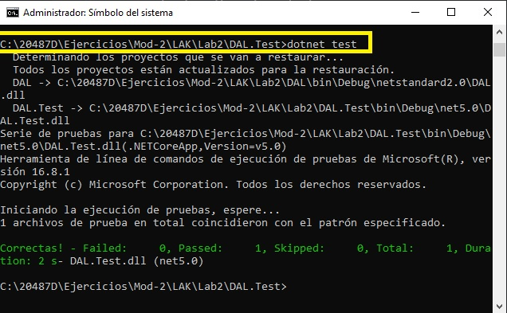
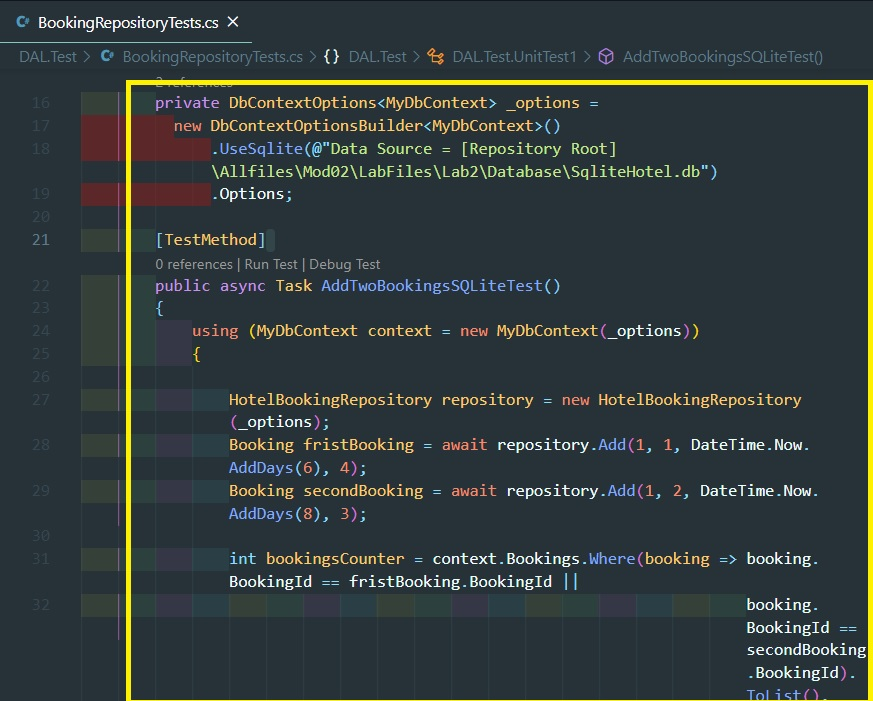

# Módulo 2: Consulta y manipulación de datos utilizando Entity Framework

Siempre cuando un camino comienza con  *[Repository Root]*, reemplacelo con el camino absoluto en el que el repositorio 20487 reside. Por ejemplo, si tu has cloneado o extraido el repositorio 20487 en la carpeta **C:\Users\John Doe\Downloads\20487**, cambiar la ruta de: **[Repository Root]\AllFiles\20487D\Mod01** a **C:\Users\John Doe\Downloads\20487\AllFiles\20487D\Mod01**.


Fichero de Instrucciones: Instructions\20487D_MOD02_LAK.md

**Información:**

La entrega de la tarea realizada se guarda en una URL de GitHub con la solución y un readme con las siguiente información:

1. **Nombres y apellidos:** José René Fuentes Cortez
2. **Fecha:** 21 de Enero 2021.
3. **Resumen del Modulo 2:** Los ejercicios se dividen entre Laboratorios y MOC Demo que contienen ejercicios propios.
En el directorio raíz de cada módulo existen dos carpetas que contienen los resumenes por separados: 
	- Módulo correspondiendo los ejercicios para cada módulo con sus resumenes correspondientes.
	- DEMO correspondiendo los ejercicios DEMO para cada módulo con sus resumenes correspondientes.

4. **Dificultad o problemas presentados y como se resolvieron:** Ninguno.

**NOTA**: Si no hay descripcion de problemas o dificultades, y al yo descargar el código para realizar la comprobacion y el código no funcionar, el resultado de la califaciación del laboratorio será afectado.

---


# Laboratorio: Creación de una Capa de Acceso a los Datos utilizando Entity Framework


### Ejercicio 1: Creación de un modelo de datos

#### Tarea 1: Crear una biblioteca de clases para el modelo de datos

1. Abre la ventana de comandos.
2. Crear un nuevo proyecto **ASP.NET Core Class Library**. 
3. En el símbolo del sistema, pegue el siguiente comando y luego presione Enter:
```bash
    dotnet new classlib --name DAL --output C:\20487D\Ejercicios\Mod-2\LAK\DAL
``` 

- La representación visual de la ejecución del comando para crear un proyecto 'ASP.NET Core Class Library', tal y como se muestra en la siguiente imagen:


3. Después de crear el proyecto, para cambiar el directorio, en la línea de comandos, ejecute el siguiente comando:
```bash
    cd C:\20487D\Ejercicios\Mod-2\LAK\DAL
```


- Cambiando el directorio a la carpeta del proyecto, tal y como se muestra en la siguiente imagen:


4. Para usar **Entity Framework Core**, instale el siguiente paquete desde la línea de comandos:
```base
    dotnet add package Microsoft.EntityFrameworkCore.SqlServer --version=2.1.1
    dotnet restore
```

- La representación visual de la ejecución del comando para agregar un paquete al proyecto 'ASP.NET Core Class Library', tal y como se muestra en la siguiente imagen:


- La representación visual de la ejecución del comando para 'dotnet restore' para restaurar el proyecto, tal y como se muestra en la siguiente imagen:


5. Para abrir el proyecto en el código de Microsoft Visual Studio, en la línea de comandos, pegue el siguiente comando:
```bash
    code .
```

- La representación visual de la ejecución del comando 'code .' para implementar el proyecto, tal y como se muestra en la siguiente imagen:


6. Para añadir una nueva carpeta llamada **Modelos**, haga clic con el botón derecho del ratón en el panel del explorador, y luego seleccione **Nueva carpeta**.

- La representación visual de la creación de la carpeta 'Models' en el proyecto, tal y como se muestra en la siguiente imagen:


#### Tarea 2: Crear entidades de modelos de datos usando el enfoque de código primero

1. Haga clic con el botón derecho del ratón en la carpeta **Models**, y luego seleccione **New File**. 2. En el cuadro de la parte superior, escriba **Traveler.cs**, y luego presione Enter.
2. En **Traveler.cs**, pegue el siguiente código:
```cs
    namespace DAL.Models
    {
        public class Traveler
        {
            public int TravelerId { get; set; }
            public string Name { get; set; }
            public string Email {get; set; }
        }
    }
```

- La representación visual del código agregado en la clase 'Traveler.cs' en el proyecto, tal y como se muestra en la siguiente imagen:


3. Haga clic con el botón derecho del ratón en la carpeta **Models**, y luego seleccione **New File**. 4. En el cuadro de arriba, escriba **Room.cs**, y luego presione Enter.
4. En **Room.cs**, pegue el siguiente código:
```cs
    using System.Collections.Generic;

    namespace DAL.Models
    {
        public class Room
        {
            public int RoomId { get; set; }
            public int Number { get; set; }
            public decimal Price { get; set; }
            public bool Available { get; set; }
            public ICollection<Booking> Bookings { get; set; } = new List<Booking>();

        }
    }
```

- La representación visual del código agregado en la clase 'Room.cs' en el proyecto, tal y como se muestra en la siguiente imagen:


5. Haga clic con el botón derecho del ratón en la carpeta **Models**, y luego seleccione **New File**. 6. En el cuadro de arriba, escriba **Hotel.cs**, y luego presione Enter.
6. En **Hotel.cs**, pegue el siguiente código:
```cs
    using System.Collections.Generic;

    namespace DAL.Models
    {
        public class Hotel
        {
            public int HotelId { get; set; }
            public string Name { get; set; }
            public string Address { get; set; }
            public ICollection<Room> Rooms { get; set; }
        }
    }
```

- La representación visual del código agregado en la clase 'Hotel.cs' en el proyecto, tal y como se muestra en la siguiente imagen:


7. Haga clic con el botón derecho del ratón en la carpeta **Models**, y luego seleccione **New File**. 8. En el cuadro de la parte superior, escriba **Booking.cs**, y luego presione Enter.
8. En **Booking.cs**, pegue el siguiente código:
```cs
    using System;

    namespace DAL.Models
    {
        public class Booking
        {
            public int BookingId { get; set; }
            public Room Room { get; set; }
            public DateTime DateCreated { get; set; }
            public DateTime CheckIn { get; set; }
            public DateTime CheckOut { get; set; }
            public int Guests { get; set; }
            public decimal TotalFee { get; set; }
            public bool Paid { get; set; }
            public Traveler Traveler { get; set; }
        }
    }
```

- La representación visual del código agregado en la clase 'Booking.cs' en el proyecto, tal y como se muestra en la siguiente imagen:


#### Tarea 3: Crear un contexto Db

1. Para añadir una nueva carpeta **Base de datos**, haga clic con el botón derecho del ratón en el panel del explorador y seleccione **Nueva carpeta**.

2. Haga clic con el botón derecho del ratón en la carpeta **Base de datos**, y luego seleccione **Nuevo archivo**. En el cuadro de la parte superior, escriba **MyDbContext.cs**, y luego presione Enter.
3. En **MyDbContext.cs**, añada lo siguiente utilizando declaraciones:
```cs
    using Microsoft.EntityFrameworkCore;
    using DAL.Models;
```
4. En **MyDbContext.cs**, bajo las declaraciones **using**, añada el siguiente código:
```cs
    namespace DAL.Database
    {
        public class MyDbContext : DbContext
        {
            public DbSet<Traveler> Travelers { get; set; }
            public DbSet<Room> Rooms { get; set; }
            public DbSet<Booking> Bookings { get; set; }
            public DbSet<Hotel> Hotels { get; set;}

            private void InitialDBContext()
            {
                DbInitializer.Initialize(this);
            }

            // Default Constructor
            public MyDbContext()
            {
                InitialDBContext();
            }

            // Constructor with options
            public MyDbContext(DbContextOptions<MyDbContext> options)
                    : base(options)
            {
                InitialDBContext();
            }

            protected override void OnConfiguring(DbContextOptionsBuilder optionsBuilder)
            {
                if (!optionsBuilder.IsConfigured)
                {
                    optionsBuilder.UseSqlServer(@"Server=.\SQLEXPRESS;Database=Mod2Lab1DB;Trusted_Connection=True;");    
                }
            }
        }
    }
```

- La representación visual de la creación de la carpeta 'Database' y del código agregado en la clase 'MyDbContext.cs' en el proyecto, tal y como se muestra en la siguiente imagen:


### Exercise 2: Consultar su base de datos

#### Tarea 1: Crear un inicializador de la base de datos con datos ficticios

1.  Haga clic con el botón derecho del ratón en la carpeta **Base de datos**, y luego seleccione **Nuevo archivo**. 2. En el cuadro de la parte superior, escriba **DbInitializer.cs**, y luego presione Enter.
2.  En **DbInitializer.cs**, añada lo siguiente utilizando declaraciones:
```cs
    using System;
    using System.Collections.Generic;
    using DAL.Models;
```
3.  En **DbInitializer.cs**, añade el siguiente código:
```cs
    namespace DAL.Database
    {
        public static class  DbInitializer
        {
            public static void Initialize(MyDbContext context)
            {
                if(context.Database.EnsureCreated())
                {
                    // Code to create initial data
                    Seed(context);
                }
            }

            private static void Seed(MyDbContext context)
            {
                 // Create list with dummy Travelers
                 List<Traveler> travelerList = new List<Traveler>
                 {
                     new Traveler(){ Name = "Jon Due", Email = "jond@outlook.com"},
                     new Traveler(){ Name = "Jon Due2", Email = "jond2@outlook.com"},
                     new Traveler(){ Name = "Jon Due3", Email = "jond3@outlook.com"}
                 };

                 // Create list with dummy bookings
                List<Booking> bookingList = new List<Booking>
                {
                    new Booking()
                    {
                        DateCreated = DateTime.Now,
                        CheckIn = DateTime.Now,
                        CheckOut = DateTime.Now.AddDays(2),
                        Guests = 2,
                        Paid = true,
                        Traveler = travelerList[0]
                    },
                    new Booking()
                    {
                        DateCreated = DateTime.Now.AddDays(3),
                        CheckIn = DateTime.Now.AddDays(5),
                        CheckOut = DateTime.Now.AddDays(8),
                        Guests = 3,
                        Paid = true,
                        Traveler = travelerList[1]
                    },
                    new Booking()
                    {
                        DateCreated = DateTime.Now.AddDays(-10),
                        CheckIn = DateTime.Now.AddDays(10),
                        CheckOut = DateTime.Now.AddDays(11),
                        Guests = 1,
                        Paid = false,
                        Traveler = travelerList[2]
                    }
                };

                 // Create list with dummy rooms
                 List<Room> roomList = new List<Room>
                 {
                     new Room(){ Number = 10, Price = 300},
                     new Room(){ Number = 20, Price = 200},
                     new Room(){ Number = 30, Price = 100}
                 };

                 roomList[0].Bookings.Add(bookingList[0]);
                 roomList[1].Bookings.Add(bookingList[1]);
                 roomList[1].Bookings.Add(bookingList[2]);

                 Hotel hotel = new Hotel()
                 {
                     Name = "Azure Hotel",
                     Address = "Cloud",
                     Rooms = roomList
                 };

                 // Insert the dummy data to the database
                 context.Travelers.AddRange(travelerList);
                 context.Bookings.AddRange(bookingList);
                 context.Rooms.AddRange(roomList);
                 context.Hotels.Add(hotel);

                 context.SaveChanges();
            }
        }
    }
```

- La representación visual del código agregado en la clase 'DbInitializer.cs' en el proyecto, tal y como se muestra en la siguiente imagen:


#### Tarea 2: Escribir una consulta integrada en el lenguaje (LINQ) para consultar los datos

1. Cierre la ventana del Código VS.
2. Crear un nuevo proyecto **Aplicación de la Consola Central de ASP.NET**. En la línea de comandos, pegue el siguiente comando y luego presione Enter:
```bash
    dotnet new console --name DatabaseTester --output C:\20487D\Ejercicios\Mod-2\LAK\DAL\DatabaseTester
```

- La representación visual del código ejecutado para crear un proyecto 'DatabaseTester' y probar la aplicación, tal y como se muestra en la siguiente imagen:


3. Después de crear el proyecto, para cambiar el directorio, en la línea de comandos, ejecute el siguiente comando:
```bash
    cd C:\20487D\Ejercicios\Mod-2\LAK\DAL
```
4. Para crear una nueva solución en los proyectos **DAL** y **DatabaseTester**, ejecute el siguiente comando:
```bash
    dotnet new sln --name Mod2Lab1
```

- La representación visual del código ejecutado para crear un proyecto solución 'Mod2Lab1' y probar la aplicación, tal y como se muestra en la siguiente imagen:


5. Para añadir el proyecto **DAL** a la solución, ejecute el siguiente comando:
```bash
    dotnet sln Mod2Lab1.sln add DAL\DAL.csproj
```

- La representación visual del código ejecutado para agregar un proyecto 'DAL' a la solución general en la aplicación, tal y como se muestra en la siguiente imagen:


6. Para añadir el proyecto **DatabaseTester** a la solución, ejecute el siguiente comando:
```bash
    dotnet sln Mod2Lab1.sln add DatabaseTester\DatabaseTester.csproj
```

- La representación visual del código ejecutado para agregar un proyecto 'DatabaseTester' a la solución general en la aplicación, tal y como se muestra en la siguiente imagen:


7. Para abrir la solución en el Código VS, en la línea de comandos, ejecute el siguiente comando:
```bash
    code .
```
  > **Nota**: Para abrir la solución en Microsoft Visual Studio, haga doble clic en el archivo **Mod2Lab1.sln**.

- La representación visual de la ejecución del código para implementar el programa 'visual code' en la aplicación, tal y como se muestra en la siguiente imagen:


8. En el panel del Explorador de Códigos VS, expanda la carpeta **DatabaseTester**, y luego haga doble clic en **DatabaseTester.csproj**.

9. En **DatabaseTester.csproj**, para añadir una biblioteca de clase **DAL** de referencia, dentro de la etiqueta **\<Project\>**, añadir el siguiente código xml:
```xml
    <ItemGroup>
        <ProjectReference Include="..\DAL\DAL.csproj" />
    </ItemGroup>
```

- La representación visual de la ejecución del código agregado para añadir una clase de referencia 'DAL', tal y como se muestra en la siguiente imagen:


10. En la carpeta **DatabaseTester**, navegar a **Program.cs**, y luego agregar las siguientes **using** declaraciones:
```cs
    using DAL.Database;
    using DAL.Models;
    using System.Linq;
    using System.Collections.Generic;
```
11. Localiza el método **Main**, y luego reemplaza el contenido con el siguiente código:
```cs
    using (MyDbContext context = new MyDbContext())
    {
        DbInitializer.Initialize(context);

        Hotel hotel = context.Hotels.FirstOrDefault();
        Console.WriteLine($"hotel name: {hotel.Name}");

        Console.WriteLine("Rooms:");
        foreach (Room room in context.Rooms.ToList())
            Console.WriteLine($"room number: {room.Number}, Price: {room.Price}");

        Console.WriteLine("Travelers:");
        foreach (Traveler traveler in context.Travelers.ToList())
            Console.WriteLine($"traveler name: {traveler.Name}, email: {traveler.Email} ");
    }
```

- La representación visual de la ejecución del código agregado en la clase 'Program.cs', tal y como se muestra en la siguiente imagen:


12. Cambie a la ventana de comandos.
13. Para cambiar el directorio al proyecto **DatabaseTester**, ejecute el siguiente comando:
```bash
    cd [Repository Root]\Allfiles\Mod02\LabFiles\Lab1\Starter\DatabaseTester
```

- La representación visual del cambio hacia el directorio para la ejecución del programa, tal y como se muestra en la siguiente imagen:


14. Para ejecutar la aplicación, ejecute el siguiente comando:
```bash
    dotnet run
```

- La representación visual de la ejecución del programa, tal y como se muestra en la siguiente imagen:


15. En la línea de comandos, compruebe que se muestran los datos de ejemplos.

# Lab: Manipulación de datos

### Ejercicio 1: Crear métodos de repositorio

#### Tarea 1: Crear un método para añadir entidades

1. Abre la ventana de comandos.
2. Para cambiar el directorio del proyecto de inicio, ejecute el siguiente comando:
```bash
    cd [Repository Root]\Allfiles\Mod02\LabFiles\Lab2\Starter
```
3. Para abrir el proyecto en Código VS, ejecute el siguiente comando:
```bash
    code .
```

- La representación visual de la ejecución del código para implementar el programa 'visual code' en la aplicación, tal y como se muestra en la siguiente imagen:


4. En la hoja de **Explorador**, bajo **Empezando**, expande la carpeta **DAL**, expande la carpeta **Repository**, y luego haz doble clic en **HotelBookingRepository.cs**.
5. Para añadir un campo privado para **DbContextOptions**, dentro de Class pegar el siguiente código:
```cs
    private DbContextOptions<MyDbContext> _options;
```
6. Para añadir un nuevo constructor que inicialice las **options**, dentro de la clase pegar el siguiente código:
```cs
    public HotelBookingRepository()
    {
        _options = new DbContextOptionsBuilder<MyDbContext>()
            .UseSqlServer(@"Server=(localdb)\.;Database=Mod2Lab2DB;Trusted_Connection=True;")
            .Options;
    }
``` 
7. Para añadir un nuevo constructor con el parámetro **options**, dentro de la clase pegar el siguiente código:
```cs
    public HotelBookingRepository(DbContextOptions<MyDbContext> options)
    {
        _options = options;
    }
```
8. Para añadir una nueva entidad de reserva a **Base de datos**, dentro de **Class**, pegue el siguiente método:
```cs
    public async Task<Booking> Add(int travelerId, int roomId, DateTime checkIn, int guest = 1)
    {
        using (MyDbContext context = new MyDbContext(_options))
        {
            Traveler traveler = context.Travelers.FirstOrDefault(t => t.TravelerId == travelerId);
            Room room = context.Rooms.FirstOrDefault(r => r.RoomId == roomId);
            if (traveler != null && room != null)
            {
                Booking newBooking = new Booking()
                {
                    DateCreated = DateTime.Now,
                    CheckIn = checkIn,
                    CheckOut = checkIn.AddDays(1),
                    Guests = guest,
                    Paid = false,
                    Traveler = traveler,
                    Room = room
                };
                Booking booking = (await context.Bookings.AddAsync(newBooking))?.Entity;
                await context.SaveChangesAsync();
                return booking;
            }
            return null;
        }
    }
```

- La representación visual del código agregado en la clase 'HotelBookingRepository.cs', tal y como se muestra en la siguiente imagen:


#### Tarea 2: Crear un método para actualizar las entidades

Para actualizar la entidad de reserva en **Base de datos**, dentro de **Class**, pegue el siguiente método:
```cs
    public async Task<Booking> Update(Booking bookingToUpdate)
    {
        using (MyDbContext context = new MyDbContext(_options))
        {
            Booking booking = context.Bookings.Update(bookingToUpdate)?.Entity;
            await  context.SaveChangesAsync();
            return booking;
        }
    }
```

#### Tarea 3: Crear un método para eliminar entidades

Para borrar la entidad de reserva de **Base de datos**, dentro de **Class**, pegue el siguiente método:

```cs
    public async void Delete(int bookingId)
    {
        using (MyDbContext context = new MyDbContext(_options))
        {
            Booking booking = context.Bookings.FirstOrDefault(b => b.BookingId == bookingId);

            if (booking != null)
            {
                context.Bookings.Remove(booking);
                await context.SaveChangesAsync();
            }
        }
    }
```


### Ejercicio 2: Probar el modelo usando SQL Server y SQLite

#### Tarea 1: Crear un código de prueba con las transacciones

1. Abre la ventana de comandos.
2. Para cambiar el directorio a la carpeta **Starter**, ejecute el siguiente comando:
```bash
    cd [Repository Root]\Allfiles\Mod02\LabFiles\Lab2\Starter
```
3. Para crear un nuevo proyecto de prueba de la unidad, ejecute el siguiente comando:
```bash
   dotnet new mstest --name DAL.Test
```

- La representación visual del código ejecutado para la creación del proyecto 'DAL.Test', tal y como se muestra en la siguiente imagen:


4. Para añadir el proyecto **DAL.Test** a la solución, ejecute el siguiente comando:
```bash
    dotnet sln Mod2Lab2.sln add DAL.Test\DAL.Test.csproj
```

- La representación visual del código ejecutado para añadir el proyecto 'DAL.Test' a la solución, tal y como se muestra en la siguiente imagen:


5. Para abrir la solución en el Código VS, ejecute el siguiente comando:
```bash
   code .
```
6. En VS Code, expande la carpeta **DAL.Test**, y luego haz doble clic en **DAL.Test.csproj**.
7. Para añadir una referencia al proyecto **DAL**, dentro del **\<proyecto\>**, pegar el siguiente código:
```xml
   <ItemGroup>
        <ProjectReference Include="..\DAL\DAL.csproj" />
   </ItemGroup>
```

- La representación visual del código agregado para añadir el proyecto 'DAL' como referencia en el proyecto, tal y como se muestra en la siguiente imagen:


8. Localiza el archivo **UnitTest1.cs**, y luego cámbiale el nombre a **BookingRepositoryTests**.
9. Añade las siguientes declaraciones **usando**:
```cs
   using System.Transactions;
   using System;
   using DAL.Repository;
   using DAL.Models;
   using DAL.Database;
   using System.Threading.Tasks;
   using System.Linq;
   using Microsoft.EntityFrameworkCore;
```
10. Cambiar **public void TestMethod1()** por **public async Task AddTwoBookingsTest()**.
11. Para probar el **Alcance de la Transacción** con dos reservas, dentro del método **AddTwoBookingsTest**, pegar el siguiente código:
```cs
    Booking fristBooking;
    Booking secondBooking;
    using (TransactionScope scope = new TransactionScope(TransactionScopeOption.Required,
            new TransactionOptions { IsolationLevel = IsolationLevel.ReadCommitted }, TransactionScopeAsyncFlowOption.Enabled))
    {
        HotelBookingRepository repository = new HotelBookingRepository();
        fristBooking = await repository.Add(1, 1, DateTime.Now.AddDays(6), 4);
        secondBooking = await repository.Add(1, 2, DateTime.Now.AddDays(8), 3);
        scope.Complete();
    }

    using (MyDbContext context = new MyDbContext())
    {
        int bookingsCounter = context.Bookings.Where(booking => booking.BookingId == fristBooking.BookingId ||
                                                                booking.BookingId == secondBooking.BookingId).ToList().Count;
        Assert.AreEqual(2, bookingsCounter);
    }
```


#### Tarea 2: Probar el código contra una base de datos local de Microsoft SQL Server

1. Cambie a la ventana de comandos.
2. Para cambiar el directorio a la carpeta **DAL.Test**, ejecute el siguiente comando:
```bash
   cd [Repository Root]\Allfiles\Mod02\LabFiles\Lab2\Starter\DAL.Test
```
3. Para probar el método **AddTwoBookingsTest**, ejecute el siguiente comando:
```bash
   dotnet test
```

- La representación visual del código para ejecutar el proyecto 'dotnet test' en el proyecto, tal y como se muestra en la siguiente imagen:



4. Abrir **Azure Data Studio**.
5. En el cuadro **Servidor**, escriba **.\SQLEXPRESS**, y luego haga clic en **Conectar**.
6. En la hoja de **Servidores**, expande **.\sqlexpress**, y luego expande **Bases de datos**.

7. Asegúrate de que la base de datos **Mod2Lab2DB** aparezca.
8. Expande el nodo **Mod2Lab2DB**, y luego expande el nodo **Tables**.
9. Haga clic con el botón derecho del ratón en **dbo.Bookings**, y luego seleccione **Select Top 1000 filas**.

- La representación visual del programa 'Azure Data Studio' para ejecutar los últimos puntos presentado de la base de datos 'Mod2Lab2DB' en el proyecto, tal y como se muestra en la siguiente imagen:


10. Compruebe que ambas reservas están guardadas en la base de datos.

#### Tarea 3: Reemplazar el proveedor de SQL Server por SQLite

1. Cambie a la ventana de comandos.
2. Asegúrate de que el directorio está en **DAL.Test**. Si no, en el símbolo del sistema, ejecute el siguiente comando::
```bash
    cd [Repository Root]\Allfiles\Mod02\LabFiles\Lab2\Starter\DAL.Test
```

3. Para usar **Entity Framework Core SQlite**, instale el siguiente paquete desde la línea de comandos:
```base
    dotnet add package Microsoft.EntityFrameworkCore.Sqlite --version=2.1.1
```

- La representación visual del código para agregar el paquete de 'Sqlite' en el proyecto, tal y como se muestra en la siguiente imagen:


4. Para restaurar todas las dependencias y herramientas de un proyecto, en la línea de comandos, ejecute el siguiente comando:
```bash
    dotnet restore
```

- La representación visual de la ejecución del comando 'dotnet restore' para restaurar el proyecto, tal y como se muestra en la siguiente imagen:


5. Para volver a la carpeta de soluciones, ejecute el siguiente comando:
```bash
   cd ..
```
6. Para abrir la solución en el Código VS, pegue el siguiente comando:
```bash
    code .
```
7. Expande la carpeta **DAL.Test**, luego haz doble clic en **BookingRepositoryTests.cs**.
8. Al comienzo de la clase, pegar el siguiente código:
```cs
     private DbContextOptions<MyDbContext> _options =
               new DbContextOptionsBuilder<MyDbContext>()
                   .UseSqlite(@"Data Source = [Repository Root]\Allfiles\Mod02\LabFiles\Lab2\Database\SqliteHotel.db")
                   .Options;
```
9. Para probar las reservas en el **SQLite**, pegue el siguiente método:

```cs
     [TestMethod]
        public async Task AddTwoBookingsSQLiteTest()
        {
            using (MyDbContext context = new MyDbContext(_options))
            {

                HotelBookingRepository repository = new HotelBookingRepository(_options);
                Booking fristBooking = await repository.Add(1, 1, DateTime.Now.AddDays(6), 4);
                Booking secondBooking = await repository.Add(1, 2, DateTime.Now.AddDays(8), 3);

                int bookingsCounter = context.Bookings.Where(booking => booking.BookingId == fristBooking.BookingId ||
                                                                        booking.BookingId == secondBooking.BookingId).ToList().Count;

                Assert.AreEqual(2, bookingsCounter);
            }
        }
```

- La representación visual del código agregado en la clase 'BookingRepositoryTests.cs' del proyecto, tal y como se muestra en la siguiente imagen:



#### Tarea 4: Probar el código contra SQLite

1. Cambie a la ventana de comandos.
2. Para cambiar el directorio a la carpeta **DAL.Test**, ejecute el siguiente comando:
```bash
   cd [Repository Root]\Allfiles\Mod02\LabFiles\Lab2\Starter\DAL.Test
```
3. Para probar el método **AddTwoBookingsTest**, ejecute el siguiente comando:
```bash
   dotnet test
```

- La representación visual del código ejecutado para testear la aplicacion del proyecto, tal y como se muestra en la siguiente imagen:


4. Abre el **DB Browser para SQLite**.
5. En la barra de menú, haga clic en **Archivo**, y luego seleccione **Abrir base de datos**.
6. En la ventana **Elegir un archivo de base de datos**, navegar hasta **[Repository Root]\Allfiles\Mod02\LabFiles\Lab2\Database**, y luego hacer doble clic en **SqliteHotel.db**.

- La representación visual de la ubicación del archivo 'SqliteHotel.sql' con la base de datos del proyecto, tal y como se muestra en la siguiente imagen:


7. En la pestaña **Estructura de la base de datos**, expande las **Tablas**.
8. Haga clic con el botón derecho del ratón en la tabla **Reservas**, y luego seleccione **Tabla de exploración**.
9. En la pestaña **Datos de Navegación**, verifique que las dos reservas existen en la base de datos.

- La representación visual de la base de datos por medio del 'SQLite Manager' en el navegador Chrome y la estructura, datos de la misma en el proyecto, tal y como se muestra en la siguiente imagen:


10. Cierre todas las ventanas abiertas.


