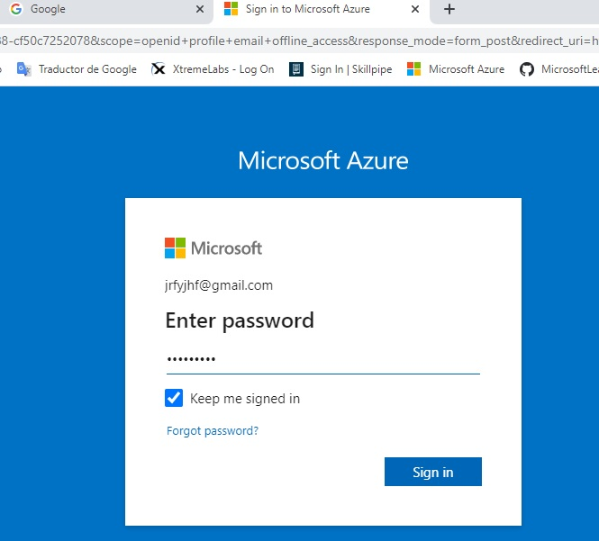
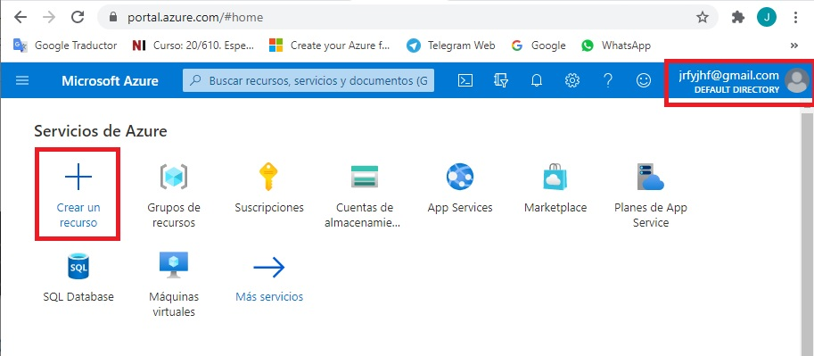
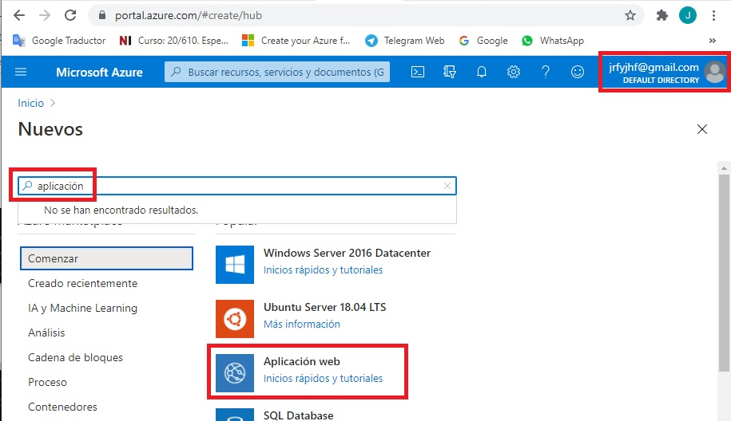
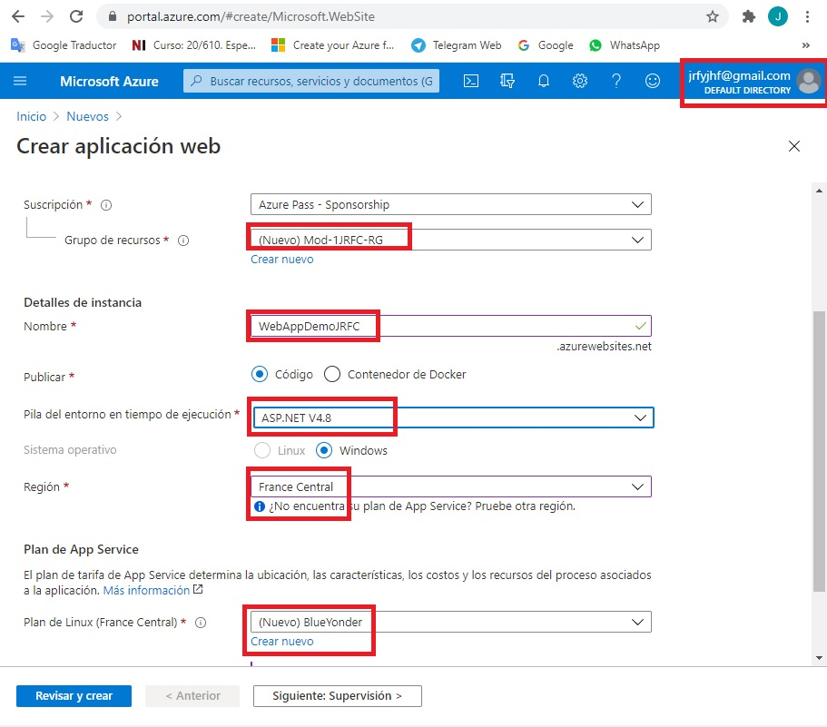
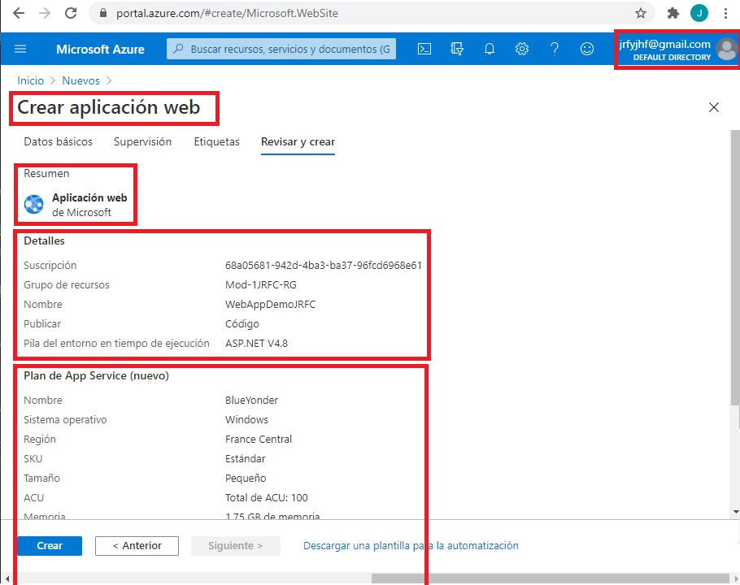
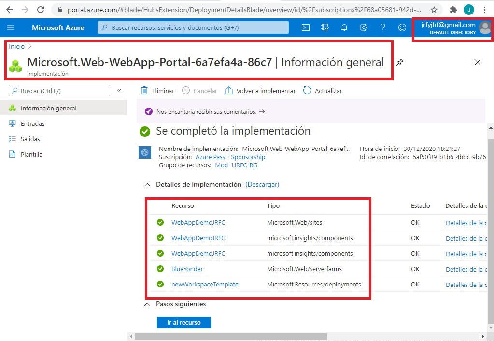
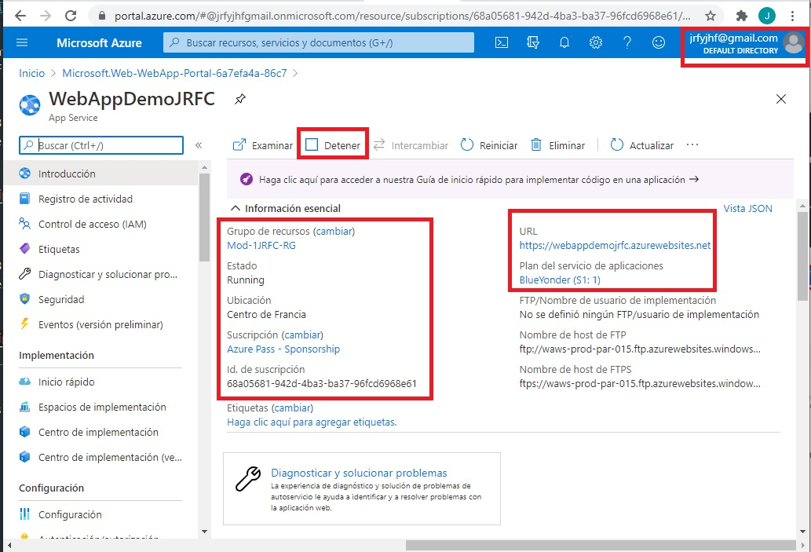

# Módulo 1: Visión general de los servicios y las tecnologías de la nube

1. Siempre cuando un camino comienza con  *[Repository Root]*, reemplacelo con el camino absoluto en el que el repositorio 20487 reside. Por ejemplo, si tu has cloneado o extraido el repositorio 20487 en la carpeta **C:\Users\John Doe\Downloads\20487**, cambiar la ruta de: **[Repository Root]\AllFiles\20487D\Mod01** a **C:\Users\John Doe\Downloads\20487\AllFiles\20487D\Mod01**.
2. Dondequiera que aparezca *[Sus iniciales]*, reemplácelo con sus iniciales reales. (Por ejemplo, las iniciales de John Doe serán jd.)
3. Antes de realizar la demostración, debe dejar un tiempo para el aprovisionamiento de los diferentes recursos Microsoft Azure necesarios para la demostración. Debes revisar las demostraciones antes de la clase real, identificar los recursos y prepararlos de antemano para ahorrar tiempo en la clase.

Fichero de Instrucciones: Instructions\20487D_MOD01_DEMO.md

**Información:**

1. **Nombres y apellidos:** José René Fuentes Cortez
2. **Fecha:** 21 de Enero 2021.
3. **Resumen del Ejercicio:** Este laboratorio consta de 4 ejercicio:
- En el Primer ejercicio nos ayuda a  crear Controllers MVC que implementen acciones comunes para la clase de modelo **City** de la aplicación.
- En el Segundo ejercicio nos ayuda a entender como podemos registrar nuevas rutas personalizadas en el canal de solicitud de Controllers de la aplicación..
- En el Tercer ejercicio creamos una clase de filtro de acción que registre los detalles de las acciones, los Controllers y los parámetros en un archivo externo cada vez que se llame a una acción..

4. **Dificultad o problemas presentados y como se resolvieron:** Ninguno.

**NOTA**: Si no hay descripcion de problemas o dificultades, y al yo descargar el código para realizar la comprobacion y el código no funcionar, el resultado de la califaciación del laboratorio será afectado.

---

# Lección 4: Computación en la nube

### Demonstration: Explorando el portal Microsoft Azure

#### Pasos de preparación

  >**Nota**: Esta demostración requiere una cuenta de Azure. Asegúrense de tener una cuenta válida antes de comenzar la demostración.

#### Pasos de la demostración

1. Abrir Microsoft Edge.
2. Navega a **https://portal.azure.com**.
3. Si aparece una página que le pide su dirección de correo electrónico, introduzca su dirección de correo electrónico, haga clic en **Siguiente**, introduzca su contraseña y luego haga clic en **Iniciar sesión**.

- Iniciando sesión en el Portal de Azure. La representación visualdel ejercicio se muestra en la siguiente imagen:

4. Si aparece el cuadro de diálogo **Stay signed in?**, haz clic en **Sí**.

   >**Nota**: Durante el proceso de inicio de sesión, si aparece una página en la que se le pide que elija de una lista de cuentas usadas anteriormente, seleccione la cuenta que usó anteriormente y continúe proporcionando sus credenciales.

5. Revise los elementos del panel de la izquierda de la pantalla y comprenda los diferentes servicios que puede gestionar con el portal Azure.

- Revisando el panel inicial del Portal de Azure. La representación visual del ejercicio se muestra en la siguiente imagen:

6. En el lado izquierdo de la pantalla, haga clic en **+ Crear un recurso**, y luego haga clic en **Aplicación web**. Los cuadros **Nombre de la aplicación** y **Grupo de recursos** y **Plan de servicio de la aplicación/localización** aparecen en el lado derecho de la pantalla.

- Pasos para la creación de un nuevo recurso por medio del panel inicial del Portal de Azure. La representación visual del ejercicio se muestra en la siguiente imagen:

7. En la casilla **Nombre de la aplicación**, introduzca el nombre de la aplicación web **WebAppDemo**_YourInitials_ (sustituya _YourInitials_ por sus iniciales).  

   >**Nota**: El nombre de la aplicación que has introducido formará parte de la URL que usarás cuando te conectes a la aplicación web.
   
8. En el cuadro **Grupo de recursos**, seleccione **Crear nuevo**.
9. Haga clic en **Plan de servicio de la aplicación/ubicación**, y luego haga clic en **Crear nuevo**. 
10. En **Plan de servicio de la aplicación**, introduzca **BlueYonder**.
11. En **Ubicación**, seleccione la ubicación más cercana a usted.
12. Pulsa **Ok.**

- Llenando los datos de los diferentes componentes para la creación de un nueva Web API por medio del panel inicial del Portal de Azure. La representación visual del ejercicio se muestra en la siguiente imagen:

13. Haga clic en **Crear**, y luego espere hasta que la aplicación web sea desplegada.
14. En el panel **Todos los recursos**, haga clic en la aplicación web que creó en el paso anterior (la que se llama **WebAppDemo** _YourInitials_)..  

   >**Nota**: Actualmente la aplicación web no tiene contenido.

- Dando nombres a todos los componentes necesarios para la creacion de la nueva Web API por medio del panel inicial del Portal de Azure. La representación visual del ejercicio se muestra en la siguiente imagen:

15. Repasa las diferentes secciones y entiende su propósito:  
  a. **General** (sin sección): Proporciona una visión general sobre la actividad de la aplicación web, el control de acceso y los metadatos. 

  - Resumen consolidado de la creación de una nueva Web API por medio del panel inicial del Portal de Azure. La representación visual del ejercicio se muestra en la siguiente imagen:

  b. **Despliegues**: Controla cómo y cuándo se despliega la aplicación.  
  c. **Ajustes**: Permite controlar ajustes como capacidades de monitoreo, acceso remoto, fichas de seguridad, escalamiento y más.

  - Resultado del recurso WEB API creado en el Portal de Azure. La representación visual del ejercicio se muestra en la siguiente imagen:

  - Inspeccionando el recurso WEB API creado en el Portal de Azure. La representación visual del ejercicio se muestra en la siguiente imagen:

16. Cierra todas las ventanas abiertas.

