# Módulo 1: Visión general de las tecnologías de servicios y de la nube

1. Siempre cuando un camino comienza con  *[Repository Root]*, reemplacelo con el camino absoluto en el que el repositorio 20487D reside. Por ejemplo, si tu has cloneado o extraido el repositorio 20487D en la carpeta **C:\Users\John Doe\Downloads\20487D**, cambiar la ruta de: **[Repository Root]\AllFiles\20487D\Mod01** a **C:\Users\John Doe\Downloads\20487\AllFiles\20487D\Mod01**.
2. Dondequiera que aparezca *[Sus iniciales]*, reemplácelo con sus iniciales reales. (Por ejemplo, las iniciales de John Doe serán jd.)
3. Antes de realizar la demostración, debe dejar un tiempo para el aprovisionamiento de los diferentes recursos Microsoft Azure necesarios para la demostración. Debes revisar las demostraciones antes de la clase real, identificar los recursos y prepararlos de antemano para ahorrar tiempo en la clase.


Fichero de Instrucciones: Instructions\20487D_MOD01_LAK.md

**Información:**

1. **Nombres y apellidos:** José René Fuentes Cutz
2. **Fecha:** 21 de Enero 2021.
3. **Resumen del Ejercicio:** Este laboratorio consta de 3 ejercicios:
- En el Primer ejercicio nos ayuda a  crear Controllers MVC que implementen acciones comunes para la clase de modelo **City** de la aplicación.
- En el Segundo ejercicio nos ayuda a entender como podemos registrar nuevas rutas personalizadas en el canal de solicitud de Controllers de la aplicación..
- En el Tercer ejercicio creamos una clase de filtro de acción que registre los detalles de las acciones, los Controllers y los parámetros en un archivo externo cada vez que se llame a una acción..

4. **Dificultad o problemas presentados y como se resolvieron:** Ninguno.

**NOTA**: Si no hay descripcion de problemas o dificultades, y al yo descargar el código para realizar la comprobacion y el código no funcionar, el resultado de la califaciación del laboratorio será afectado.

---
dotnet new webapi --name BlueYonder.Flights --output C:\20487D\Ejercicios\Mod-1\LAK\BlueYonder.Flights

### Ejercicio 1: Crear un proyecto central de ASP.NET

#### Tarea 1: Crear un nuevo proyecto básico de ASP.NET

1. Abrir una ventana de comandos.
2. Crear un nuevo proyecto **ASP.NET Core Web API**. En la línea de comandos, pegue el siguiente comando y luego presione Enter.
  ```bash
    dotnet new webapi --name BlueYonder.Flights --output C:\20487D\Ejercicios\Mod-1\LAK\BlueYonder.Flights
  ```

- La representación visual de la ejecución del comando anterior en una terminal de Windows, tal y como se muestra en la siguiente imagen:

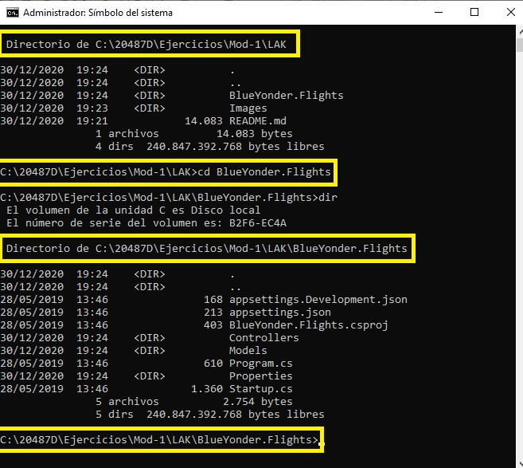


3. Después de crear el proyecto, cambie la carpeta en la línea de comandos ejecutando el siguiente comando:
  ```bash
    cd C:\20487D\Ejercicios\Mod-1\LAK\BlueYonder.Flights
  ```

- La representación visual de la ejecución del comando anterior en una terminal de Windows, tal y como se muestra en la siguiente imagen:

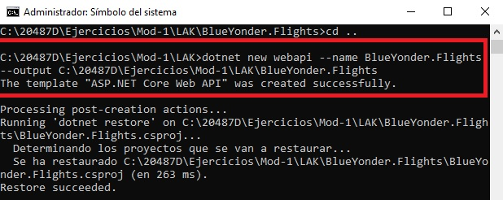

### Ejercicio 2: Creación de un modelo de marco de entidad simple

#### Tarea 1: Crear una nueva entidad POCO

1. Para usar **Entity Framework Core**, necesitas instalar el siguiente paquete usando el símbolo del sistema.
  ```bash
    dotnet add package Microsoft.EntityFrameworkCore.SqlServer --version=2.1.1
    dotnet restore
  ```

- La representación visual de la ejecución del comando en una terminal de Windows para agregar un paquete en el proyecto, tal y como se muestra en la siguiente imagen:

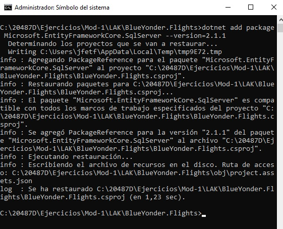

- La representación visual de la ejecución del comando 'dotnet restore' en una terminal de Windows, tal y como se muestra en la siguiente imagen:

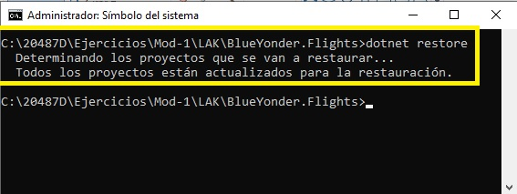

2. Abre el proyecto en **VSCode** y pega el siguiente comando, y luego presiona Enter. 
  ```bash
    code .
  ```
3. La carpeta **BlueYonder.Flights** se abre en **VSCode**. Selecciona el archivo **Startup.cs**.
    - Seleccione **Sí** a los **Activos necesarios para construir y depurar faltan en 'BlueYonder.Flights'. Añadirlos? ** mensaje.
    - Selecciona **Restaurar** en el mensaje **Hay dependencias no resueltas**.
4. Haga clic en el panel del Explorador de Archivos a la izquierda, seleccione **Nueva Carpeta**, y luego nombre la carpeta **Models**.

- La representación visual de la creación de la carpeta 'Models' en el visual code de Windows, tal y como se muestra en la siguiente imagen:

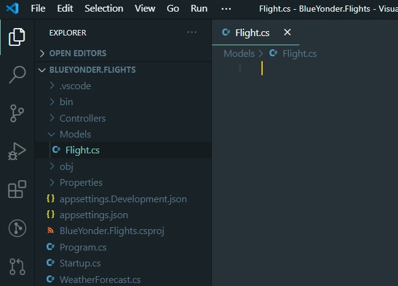

5. Haga clic con el botón derecho del ratón en la carpeta **Models**, seleccione **Nuevo Archivo**, y luego póngale un nombre **Fligth.cs**.
6. En el archivo **Fligth.cs**, pegue la siguiente declaración **utilizando** debajo del comienzo del archivo:
  ```cs
    using System;
  ```
7. Para crear el modelo de clase **Vuelo**, pegue el siguiente código en el archivo **Fligth.cs**:
  ```cs
    namespace BlueYonder.Flights.Models
    {
        public class Flight
        {
            public int Id { get ;set; }
            public string Origin { get; set; }
            public string Destination { get; set; }
            public string FlightNumber { get; set; }
            public DateTime DepartureTime { get; set; }
        }
    }
  ```
- La representación visual del código agregado a la clase 'Flight.cs', tal y como se muestra en la siguiente imagen:

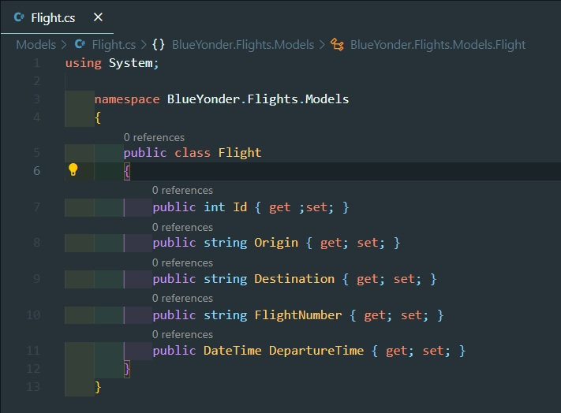
#### Tarea 2: Crear una nueva clase de DbContext

1. Haga clic con el botón derecho del ratón en la carpeta **Models**, seleccione **New File**, y luego póngale un nombre **FlightsContext.cs**.

- La representación visual de la creación de la clase 'FlightsContext.cs', tal y como se muestra en la siguiente imagen:

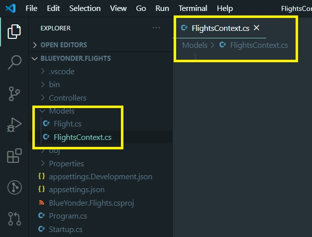

2. En la parte superior del archivo **FlightsContext**, pegar la siguiente declaración **utilizando**:
  ```cs
    using Microsoft.EntityFrameworkCore;
  ```
3. Para añadir una nueva clase de **espacio de nombres**, pegue el siguiente código:
  ```cs
    namespace BlueYonder.Flights.Models
    {

    }
  ```
4. Para declarar que **FlightsContext** fue heredado de la clase **DbContext**, dentro de los corchetes del **espacio de nombres**, pegue el siguiente código:
  ```cs
    public class FlightsContext : DbContext
    {

    }
  ```
5. Dentro de la clase, pegue el siguiente código: 
  ```cs
    public FlightsContext(DbContextOptions<FlightsContext> options)
        : base(options)
    {
    }

    public DbSet<Flight> Flights { get; set; }
  ```

- La representación visual del código agregado a la clase 'FlightsContext.cs', tal y como se muestra en la siguiente imagen:

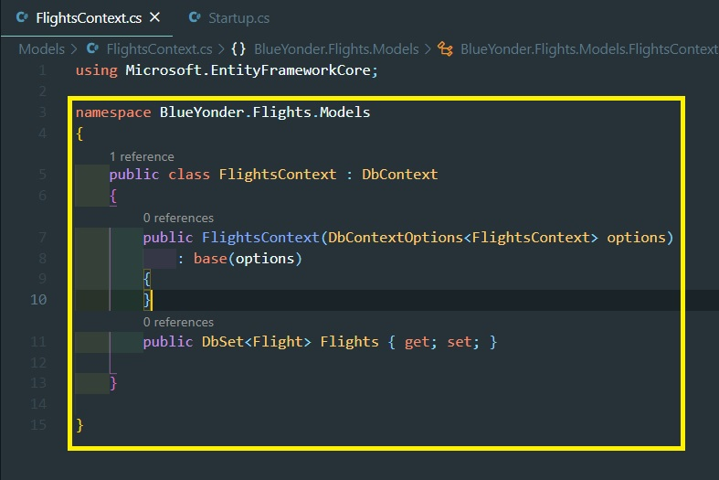

6. Ve a **Startup.cs** y pega las siguientes **declaraciones de uso**:
  ```cs
    using BlueYonder.Flights.Models;
    using Microsoft.EntityFrameworkCore;
  ```
7. En el método **ConfigureServices**, pegue el siguiente código: 
  ```cs
    services.AddDbContext<FlightsContext>(opt => opt.UseSqlServer(Configuration.GetConnectionString("defaultConnection")));
  ```    
- La representación visual del código agregado a la clase 'Startup.cs', tal y como se muestra en la siguiente imagen:

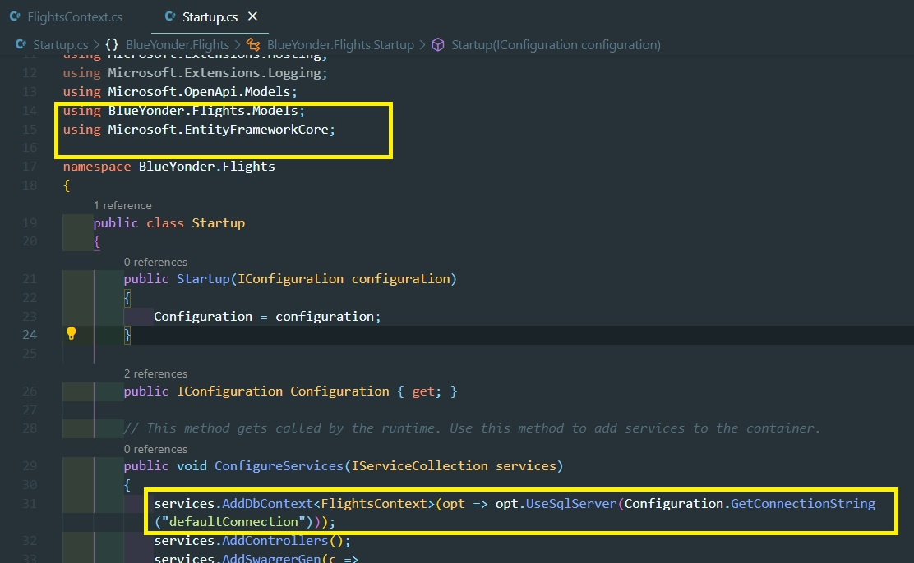

### Ejercicio 3: Crear una clase de API Web

#### Tarea 1: Crear una nueva clase para la API web

1. Expande la carpeta **Controladores**, y luego renombra **ValoresControladores.cs** a **Controlador.cs**.
2. Abrir el archivo **FlightsController.cs**, y luego renombrar la clase **ValuesController** a **FlightsController**.
3. Añade la siguiente declaración **using**:
  ```cs
    using BlueYonder.Flights.Models;
  ```
4. Para mantener **FlightContext**, añade el siguiente campo a la clase:
  ```cs
    private readonly FlightsContext _context;
  ```
5. Para inyectar el contexto al controlador, agregue el siguiente **Constructor** a la clase:
  ```cs
    public FlightsController(FlightsContext context)
    {
        _context = context;
    }
  ```

#### Tarea 2: Crear una acción y utilizar el contexto del Marco de Entidades

1. Para recuperar la lista de todos los vuelos, reemplace el primer método **Get** con el siguiente código:
  ```cs
    // GET api/flights
    [HttpGet]
    public IEnumerable<Flight> Get()
    {
        return _context.Flights.ToList();
    }
  ```    
2. Para crear un nuevo vuelo a db, reemplace el método **Post** con el siguiente código:
  ```cs
    // POST api/flights
    [HttpPost]
    public IActionResult Post([FromBody]Flight flight)
    {
        _context.Flights.Add(flight);
        _context.SaveChanges();
        return CreatedAtAction(nameof(Get), flight.Id);
    }
  ```

- La representación visual del código agregado a la clase 'Startup.cs', tal y como se muestra en la siguiente imagen:

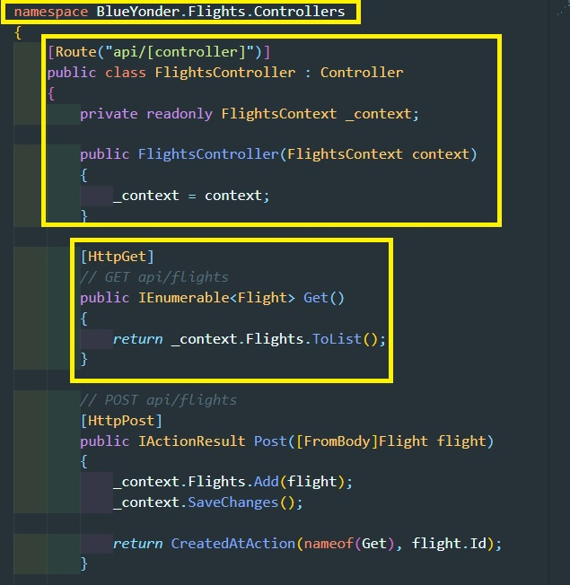

### Ejercicio 4: Desplegando la Aplicación Web al Azur

#### Tarea 1: Crear una aplicación web Azure y una base de datos SQL

1. Abrir Microsoft Edge.
2. Navega a **https://portal.azure.com**.
3. Si aparece una página pidiendo tu dirección de correo electrónico, introduce tu dirección de correo electrónico, haz clic en **Siguiente**, introduce tu contraseña y luego haz clic en **Iniciar sesión**.

4. Si aparece el cuadro de diálogo **Stay signed in?**, haz clic en **Sí**.
   >**Nota**: Durante el proceso de inicio de sesión, si aparece una página en la que se le pide que elija de una lista de cuentas usadas anteriormente, seleccione la cuenta que usó anteriormente y continúe proporcionando sus credenciales.
5. Para mostrar todos los recursos de Azure, en el panel de menú de la izquierda, haga clic en **Todos los recursos**.

- La representación visual del panel de Azure donde podemos agrgar un recurso, tal y como se muestra en la siguiente imagen:

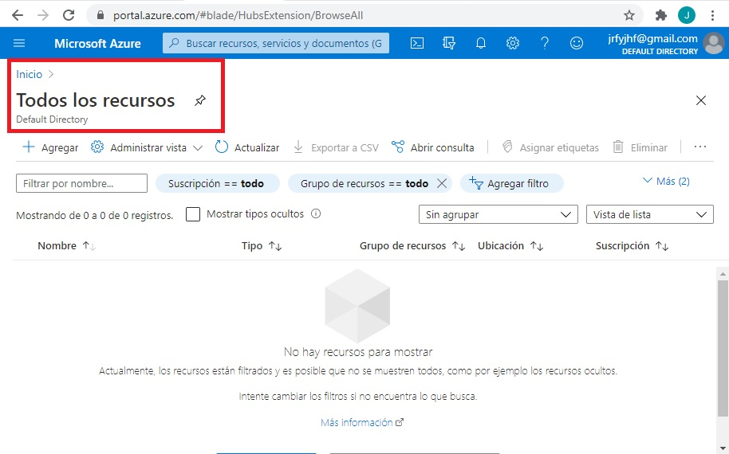

    - Para seleccionar la plantilla del servicio de aplicaciones, en la hoja **Todos los recursos**, haga clic en **Agregar**.
    - Para ver una visión general de la plantilla, en el cuadro de búsqueda, busque **Web App + SQL** y pulse intro. 

- La representación visual de la creación de un Web API como un tipo de recurso 'Aplicación Web y SQL', tal y como se muestra en la siguiente imagen:

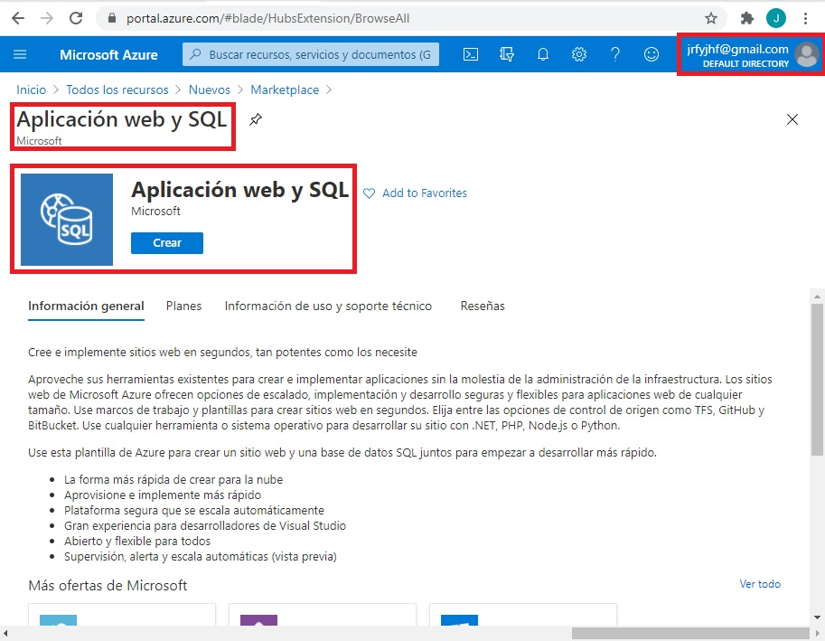
    - En el blade **Aplicación web + SQL**, haga clic en **Crear**.

- La representación visual del panel de Azure donde podemos agrgar un recurso, tal y como se muestra en la siguiente imagen:

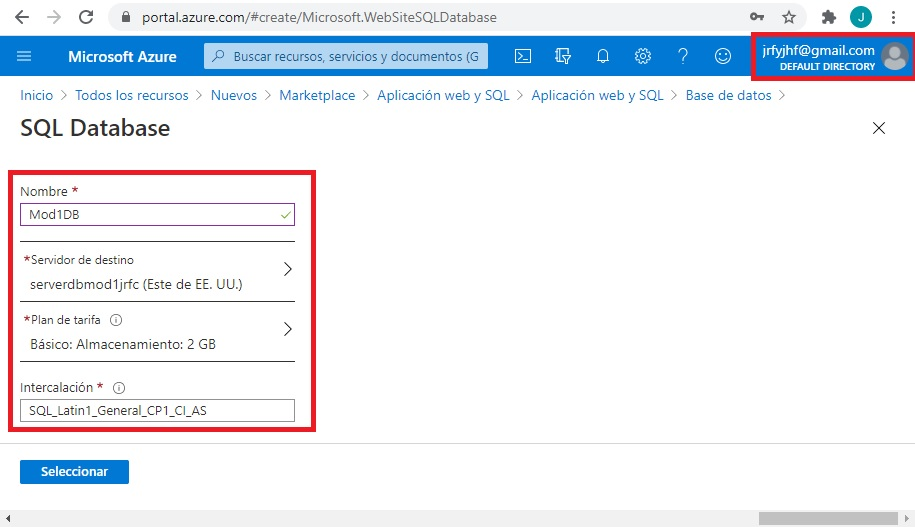

6. Para crear la **Aplicación Web**, introduzca los siguientes campos:
    - En el cuadro **Nombre de la aplicación**, introduzca el nombre de la aplicación web **flightsmod1lab***YourInitials*.
   >**Nota**: El **Nombre de la aplicación** formará parte de la URL.
    - En **Grupo de recursos**, seleccione **Crear nuevo**, y luego introduzca **Mod1Resource**.
    - Haga clic en **Base de datos SQL**, seleccione **Crear una nueva base de datos**, abra la hoja **Base de datos SQL**, y luego llene la siguiente información:
       - En la casilla **Nombre**, escriba **Mod1DB**.
        - Haga clic en **Target server**, y luego haga clic en **Crear un nuevo servidor**.
  - La representación visual del panel de Azure como podemos agrgar las características del recurso, tal y como se muestra en la siguiente imagen:

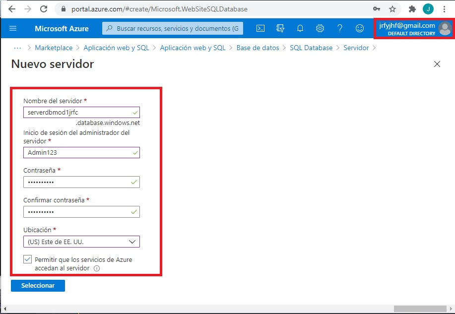
        - En la hoja **Nuevo servidor**, introduzca la siguiente información:
            - En el cuadro **Nombre del servidor**, escriba **servidordbmod1***TusIniciales*.
    - La representación visual del panel de Azure como podemos agrgar las características del recurso, tal y como se muestra en la siguiente imagen:

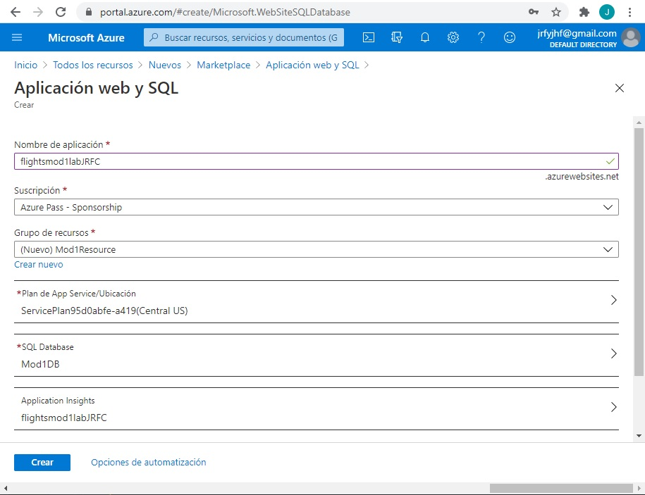
            - En el cuadro **Server admin login**, escriba **Admin123**.
            - En las casillas **Contraseña** y **Confirmar contraseña**, escriba **Password99**.
            - Haga clic en **Seleccionar**.
        - Haga clic en **Nivel de precios**, seleccione **Libre**, y luego haga clic en **Aplicar**.
  - La representación visual del resumen personalizado de la aplicación Web y SQL, tal y como se muestra en la siguiente imagen:

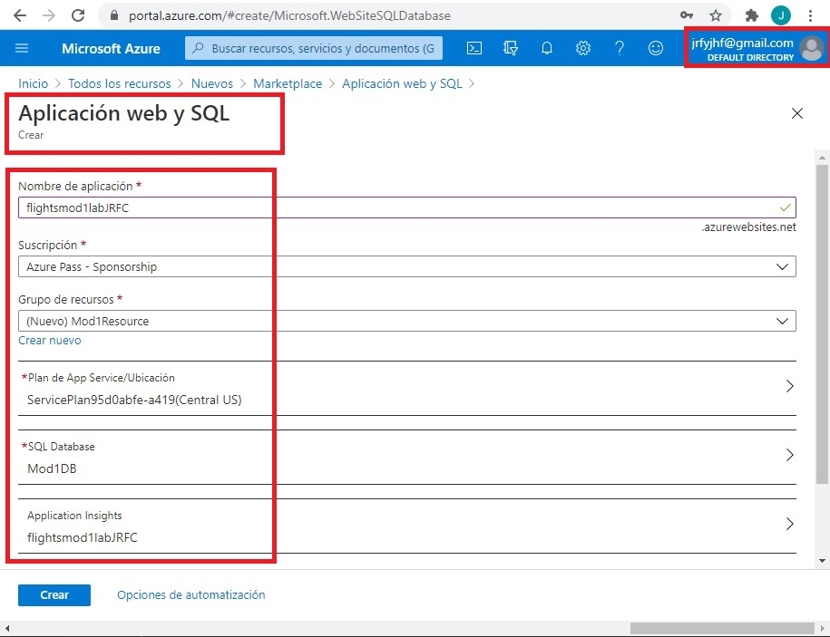
        - Haga clic en **Seleccionar**.
    - Haga clic en **Crear**.

  - La representación visual del resumen después de la creación de los recursos creado para el Web API, tal y como se muestra en la siguiente imagen:

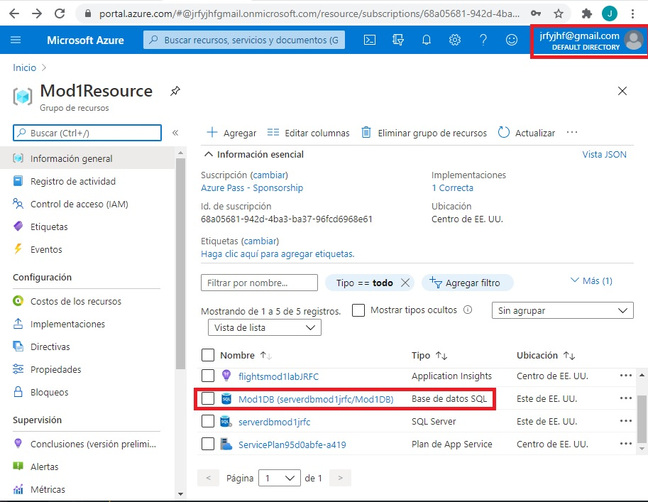

7. Para mostrar todas las bases de datos SQL, en el panel de menú de la izquierda, haga clic en **Bases de datos SQL**.
8. Para ejecutar los scripts de la base de datos, haga clic en **Mod1DB**, y luego haga clic en **Query editor(preview)**.

  - La representación visual de la ubicación del editor de consulta en el panel de la base de datos de la Web API, tal y como se muestra en la siguiente imagen:

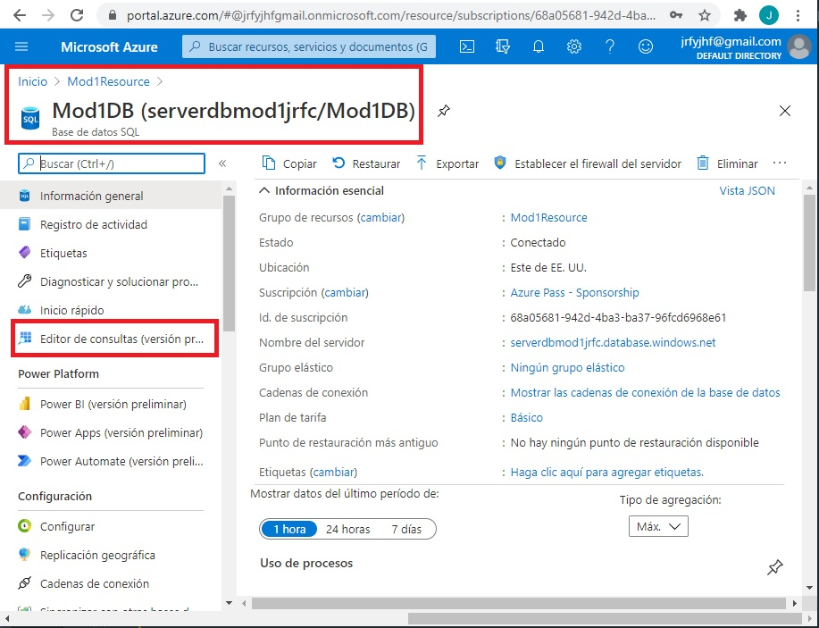

9. Haga clic en **Login**, introduzca la siguiente contraseña **Password99** y luego haga clic en **OK**.
10. Para crear una nueva tabla en **Base de datos SQL**, dentro de la pestaña **Query 1**, pegar el siguiente script, y luego hacer clic en **Run**:
  ```sql
    CREATE TABLE [dbo].[Flights](
    [Id] [int] IDENTITY(1,1) NOT NULL,
    [Origin] [varchar](50) NOT NULL,
    [Destination] [varchar](50) NOT NULL,
    [FlightNumber] [varchar](50) NOT NULL,
    [DepartureTime] [date] NOT NULL,
    
    PRIMARY KEY CLUSTERED 
    (
        [Id] ASC
    ))
  ```
  - La representación visual del acceso a la base de datos en el panel de la base de datos de la Web API, tal y como se muestra en la siguiente imagen:

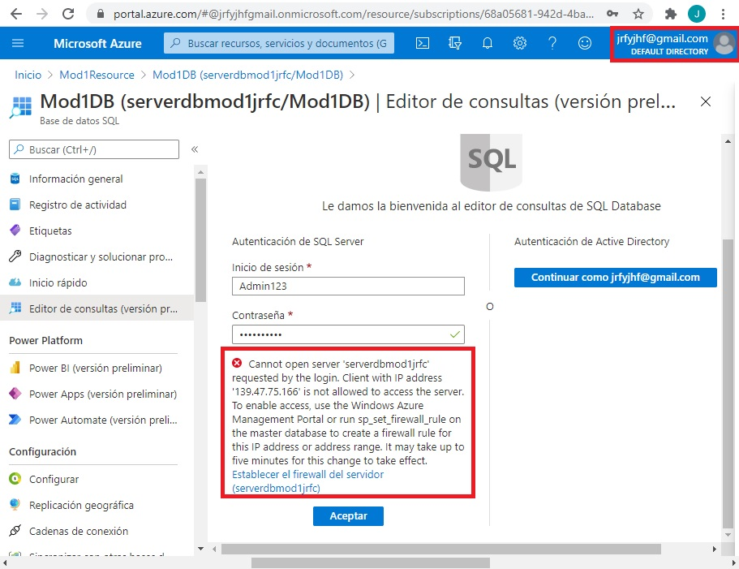

- Para corregir el mensaje mostrado sobre el acceso al server tenemos que crear una regla en el firewall que este tenga los privilegios para el usuario del SQL Server, como se muestra en la siguiente image.

  - La representación visual de la creación de una regla con el Firewall para el ip del cliente en la Web API, tal y como se muestra en la siguiente imagen:

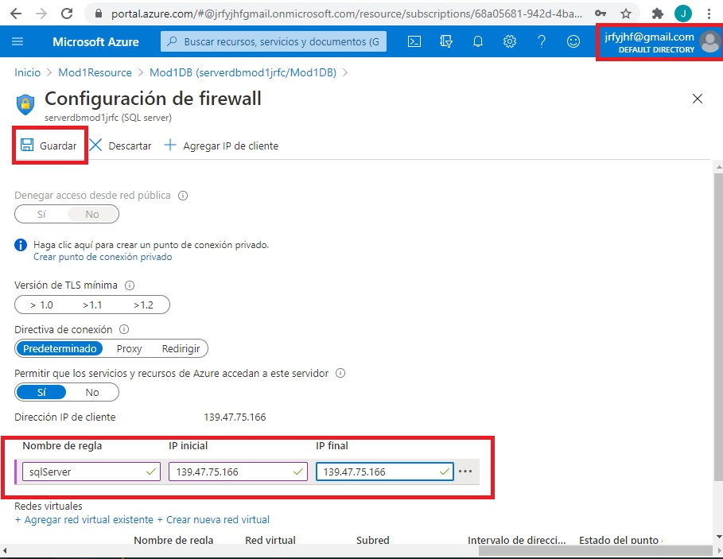

  - La representación visual del código SQL parr la creación de tablas en la base de datos de la Web API, tal y como se muestra en la siguiente imagen:

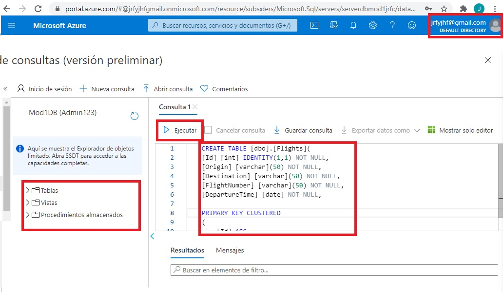

#### Tarea 2: Desplegar la aplicación web en la Azure Web App

1. Cambie a Portal Azul.
2. Para mostrar todos los servicios de aplicación, en el menú de la izquierda, haga clic en **Servicios de aplicación**.
3. Para ver las configuraciones de servicios de aplicaciones, en la hoja **Servicios de aplicaciones**, haga clic en **flightsmod1lab***YourInitials*.
   >**Nota**: Si su edición no guardada será descartada, en el cuadro de diálogo que aparece, haga clic en **OK**.

  - La representación visual del código SQL para la creación de tablas en la base de datos de la Web API, tal y como se muestra en la siguiente imagen:

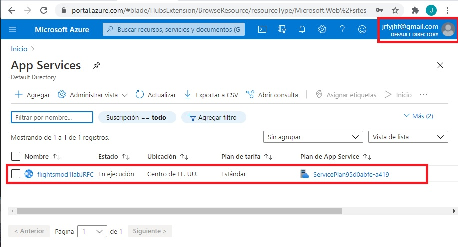

4. Para añadir credenciales al servicio de la aplicación, en la sección **Deployment**, haga clic en **Deployment credentials**, y luego complete la siguiente información:
   - En **FTP/nombre de usuario de despliegue**, introduzca **FTPMod1Lab***TusIniciales*.
   - En las casillas **Contraseña** y **Confirmar contraseña**, escriba **Password99**.
   - Haga clic en **Save**.
   >**Nota**: El **Credenciales de despliegue** da las opciones para desplegar la aplicación desde la línea de comandos.

  - La representación visual de la configuración de las Credenciales de despliegue para el servicio de aplicaciones en la Web API, tal y como se muestra en la siguiente imagen:

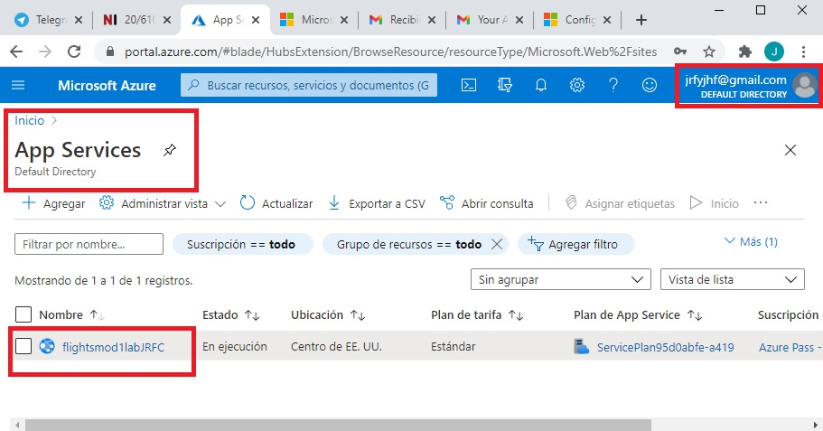

  - Al crear el servicio no ha se creado el usuario FTP que sirve para el transporte de datos hacia la aplicación para ellos tenemos que crear las credenciales correspondientes, tal y como se muestra en la siguiente imagen:

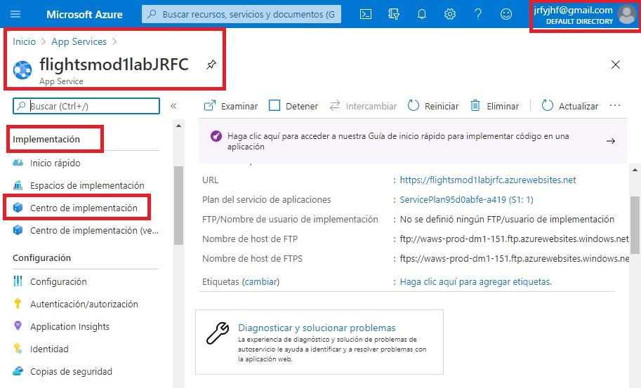

  - Para crear el usuario FTP, una vez de haber hecho clic en el centro de implentación hacemos clic en 'FTP', tal y como se muestra en la siguiente imagen:

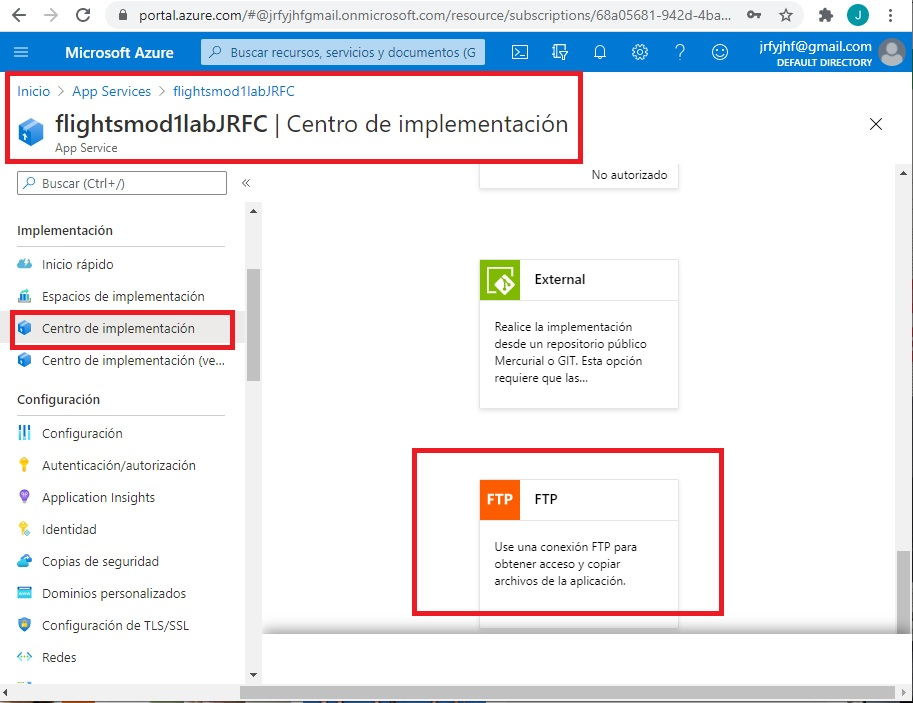

  - El siguiente paso es crear las 'Credenciales de usuario' para el usuario FTP, tal y como se muestra en la siguiente imagen:

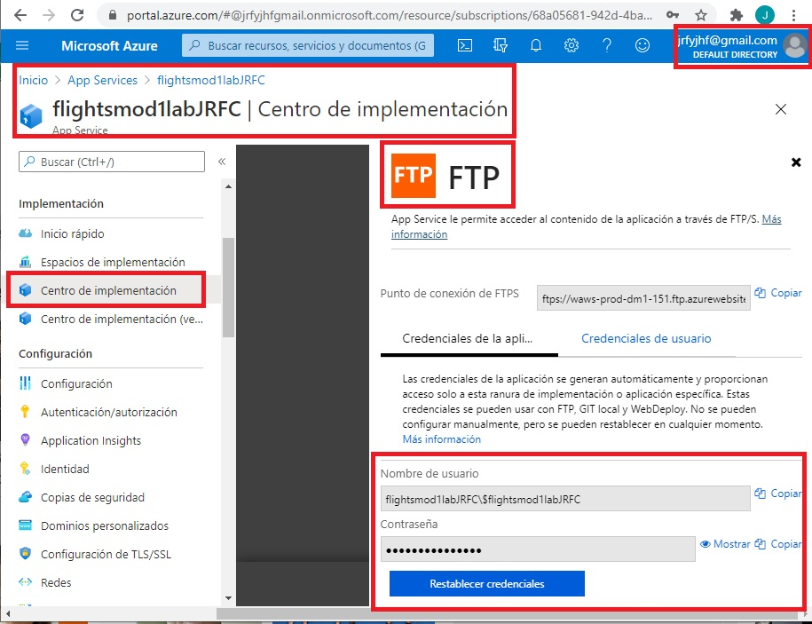


  - Resultado de la creación de las 'Credenciales de usuario' para el usuario FTP, tal y como se muestra en la siguiente imagen:

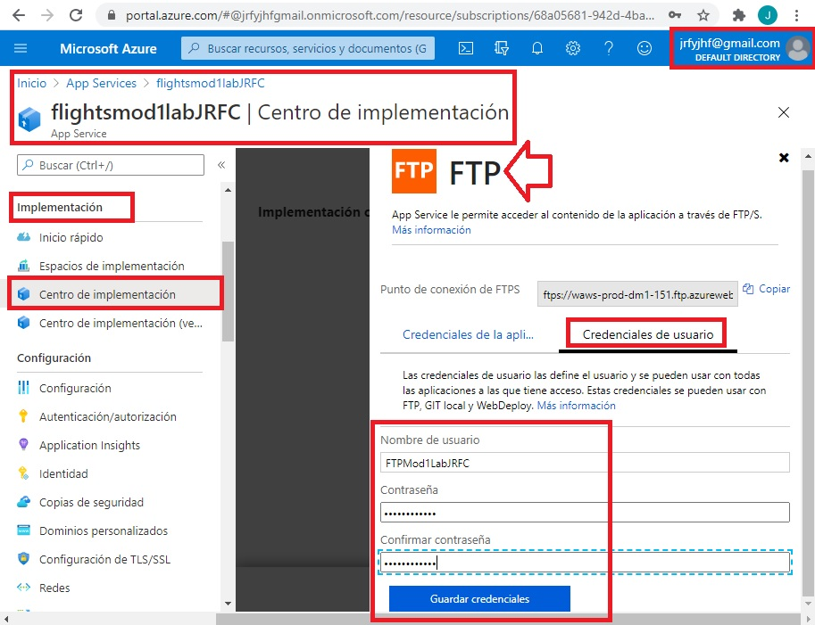


  - Resultado de la creación del usuario FTP con sus credenciales, tal y como se muestra en la siguiente imagen:

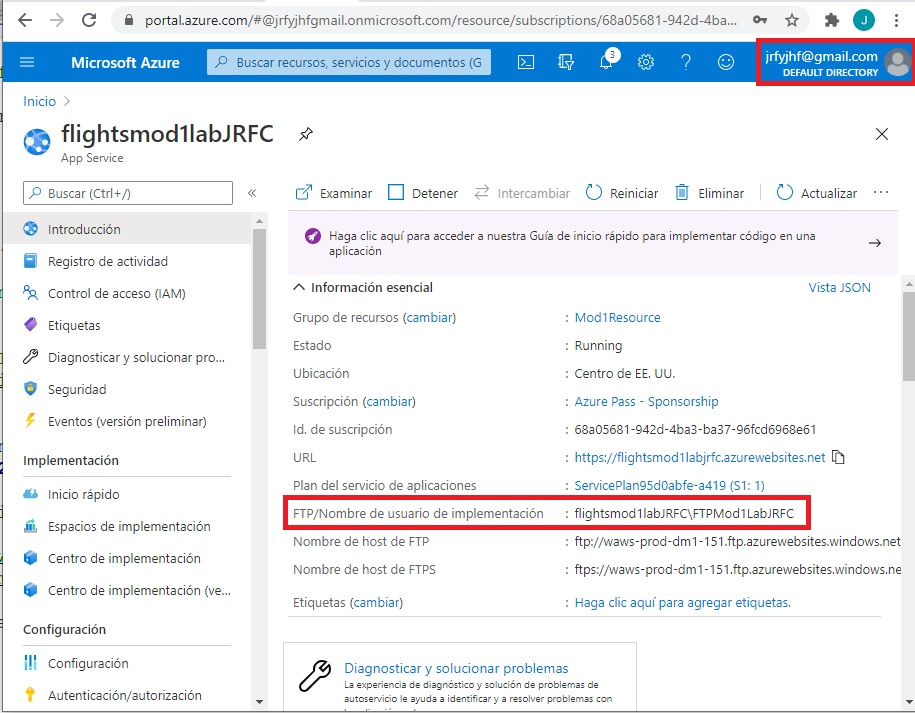

5. Cambiar al proyecto en **VSCode**.
6. Haga clic con el botón derecho del ratón en el panel del Explorador de archivos de la izquierda, seleccione **Nueva carpeta**, y luego nombre la carpeta **Propiedades** .
7. Haga clic con el botón derecho del ratón en la carpeta **Propiedades**, seleccione **Nueva Carpeta**, y luego nombre la carpeta **PublicarPerfiles**.

8. En **PublishProfiles**, agregue el archivo **Azure.pubxml**, y luego haga doble clic en el archivo.
9. Pega el siguiente código:
  ```xml
		<Project>
			<PropertyGroup>
			  <PublishProtocol>Kudu</PublishProtocol> <PublishSiteName>flightsmod1labJRFC</PublishSiteName>
			  <UserName>FTPMod1LabJRFC</UserName>
			  <Password>Password99**</Password>
			</PropertyGroup>
		</Project>
  ```

    - La representación visual del archivo 'Azure.pubxml' con los datos personalizados para su correspondiente publicación en el Portal de Azure, tal y como se muestra en la siguiente imagen:

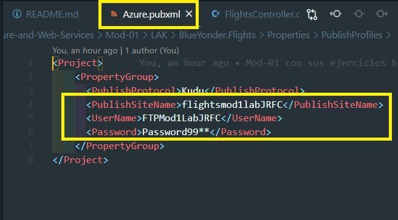

    >**Nota**: Este archivo tiene la información para desplegar a Azure con **Credenciales de despliegue** que añadimos en el paso 4.
10. En la línea de comandos, pegue el siguiente comando:
  ```bash
        dotnet publish /p:PublishProfile=Azure /p:Configuration=Release
  ```

  - La representación visual de la ejecución del comando para la publicación del Web API en el Portal Azure, tal y como se muestra en la siguiente imagen:

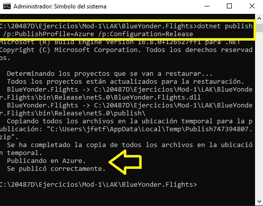

   > **Nota**: Si se produce un error durante el proceso de publicación, reinicie los servicios de la aplicación **flightsmod1lab{YourInitials}**.

#### Tarea 3: Probar la API web

1. Abrir **PowerShell**.
2. Para añadir un vuelo a la base de datos, pegue el siguiente comando:
  ```bash
    $postParams = "{'origin': 'Germany',
        'destination': 'France',
        'flightNumber': 'GF7625',
        'departureTime': '0001-01-01T00:00:00'}"
    Invoke-WebRequest -Uri http://flightsmod1labJRFC.azurewebsites.net/api/flights -ContentType "application/json" -Method POST -Body $postParams
  ```

  - Visualizando la ejecución de las lineas de comando para agregar un registro en la aplicación web por medio del Portal de Azure, tal y como se muestra en la siguiente imagen:

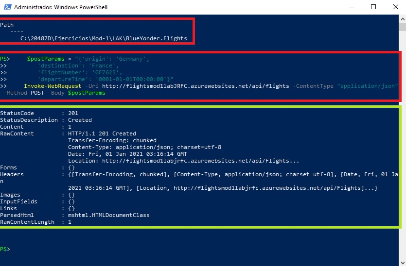

 > **Nota**: Si hay un error, intente ejecutar el siguiente comando **[Net.ServicePointManager]::SecurityProtocol = [Net.SecurityProtocolType]::Tls12**, y vuelva a intentarlo. 
3. Abra Microsoft Edge.
4. Navegue hasta la siguiente dirección URL:
  ```
    https://flightsmod1labJRFC.azurewebsites.net/api/flights
	ayuda: https://docs.microsoft.com/es-es/azure/app-service/deploy-configure-credentials
  ```
5. Compruebe que obtiene el siguiente resultado:
  ```javascript
    [
        {
           id: 1,
           origin: "Germany",
           destination: "France",
           flightNumber: "GF7625",
           departureTime: "0001-01-01T00:00:00"
        }
    ]
  ```

 - Visualizando la ejecución del Web API por medio de la URL y la verificación del registro agregado por medio del Portal de Azure, tal y como se muestra en la siguiente imagen:

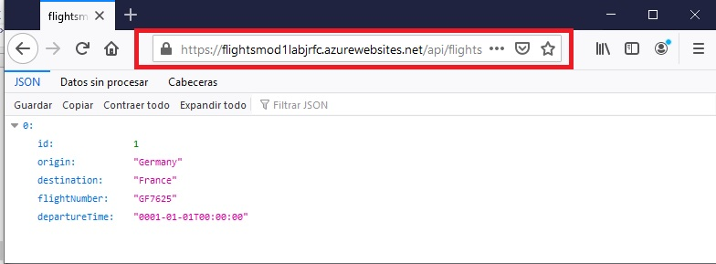

#### Tarea 4: Ver el resultado en la base de datos

1. Cambie a Portal Azul.
2. En el panel de menú de la izquierda, haga clic en **Bases de datos SQL**.
3. Haga clic en **Mod1DB**, y luego haga clic en **Query editor(preview)**.

- Visualizando el query editor para la ejecución del comando SQL de los registros en la base de datos, tal y como se muestra en la siguiente imagen:

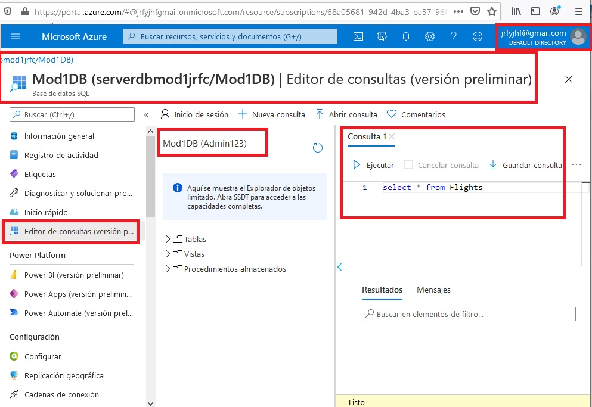

4. Haga clic en **Login**, y luego escriba la contraseña **Password99**.
5. Para obtener todos los vuelos de la base de datos, pegue el siguiente script dentro de la pestaña **Query 1**, y luego haga clic en **Run**:
  ```sql
    select * from Flights
  ```
6. Comprueba que tienes el vuelo en la pestaña de **Resultados**.

- Visualizando la ejecución del comando SQL de los registros guardados en la base de datos, tal y como se muestra en la siguiente imagen:

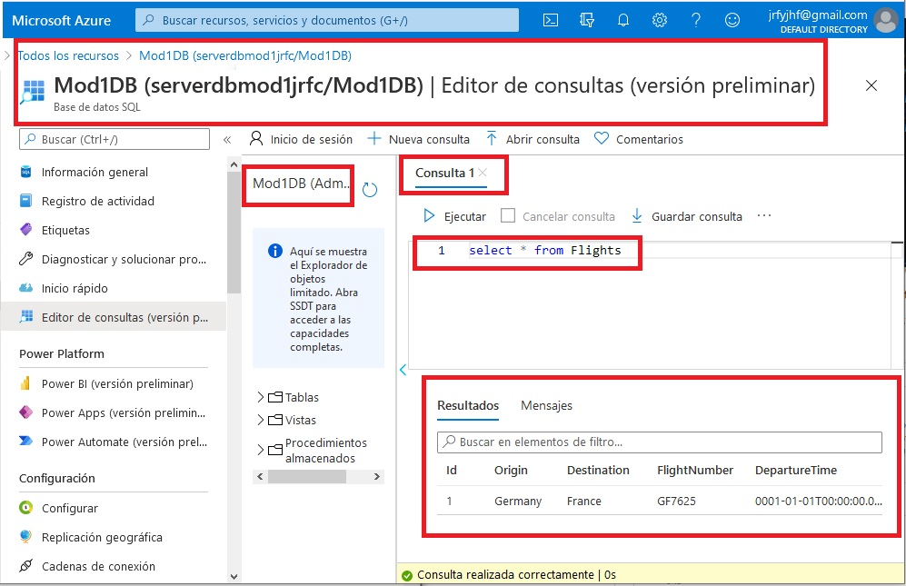